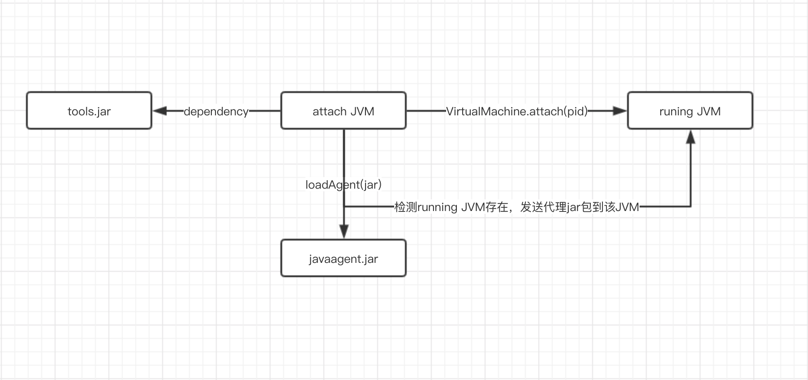

## 介绍

**JavaAgent**是在JDK5之后提供的新特性，也可以叫java代理。开发者通过这种机制(**Instrumentation**)可以在加载class文件之前修改方法的字节码(此时字节码尚未加入JVM)。

从业务的角度，Agent 可以提供监控服务，如方法调用时长、可用率、内存等。从安全的角度，破解java软件、Agent内存马也需要用到此特性。此外，目前基于插桩技术实现Java程序的动态交互安全监测已经有一些实现形式，如RASP，IAST。在Java中插桩通过Instrument以及字节码操作工具(如:ASM,Javassist,Byte Buddy等)实现。

## premain 

1. 定义一个 MANIFEST.MF 文件，必须包含 Premain-Class 选项，通常也会加入Can-Redefine-Classes 和 Can-Retransform-Classes 选项。（或者在pom.xml里用插件配置）
2. 创建一个Premain-Class 指定的类，类中包含 premain 方法，方法逻辑由用户自己确定。
3. 将 premain 的类和 MANIFEST.MF 文件打成 jar 包。
4. 使用参数 -javaagent: jar包路径 启动要代理的方法。

JVM 会先执行 premain 方法，大部分类加载都会通过该方法，既然可以拦截类的加载，那么就可以配合字节码工具重写这类的操作。

## attach 

有点像TCP创建连接的三次握手，目的就是搭建attach通信的连接。而后面执行的操作，例如`vm.loadAgent`，其实就是向这个socket写入数据流，接收方Agnt会针对不同的传入数据来做不同的处理（**agentmain**）。

## 总结

**启动时加载instrument agent过程：**

1. 创建并初始化 JPLISAgent；
2. 监听 `VMInit` 事件，在 JVM 初始化完成之后做下面的事情：
   1. 创建 InstrumentationImpl 对象 ；
   2. 监听 ClassFileLoadHook 事件 ；
   3. 调用 InstrumentationImpl 的`loadClassAndCallPremain`方法，在这个方法里会去调用 javaagent 中 MANIFEST.MF 里指定的**Premain-Class **类的 `premain` 方法 ；
3. 解析 javaagent 中 MANIFEST.MF 文件的参数，并根据这些参数来设置 JPLISAgent 里的一些内容。

**运行时加载instrument agent过程：**

1. 创建并初始化JPLISAgent；
2. 解析 javaagent 里 MANIFEST.MF 里的参数；
3. 创建 InstrumentationImpl 对象；
4. 监听 ClassFileLoadHook 事件；
5. 调用 InstrumentationImpl 的`loadClassAndCallAgentmain`方法，在这个方法里会去调用javaagent里 MANIFEST.MF 里指定的**Agent-Class**类的`agentmain`方法。

**什么时候调用`ClassFileTransformer.transform()`**：

1. 新的 class 被加载。(对应`premain`)
2. Instrumentation.redefineClasses 显式调用。
3. addTransformer 第二个参数为 true 时，Instrumentation.retransformClasses 显式调用。(对应`agentmain`)

## 实践

[记一次Agent之旅](https://theoyu.top/2022/02/27/agentStudy.html)